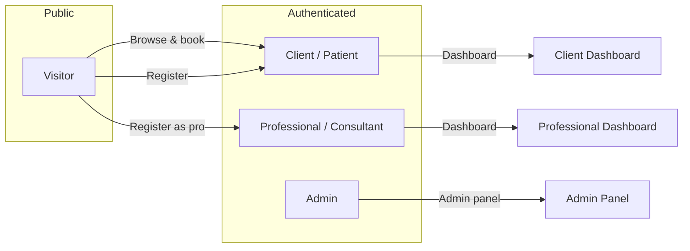
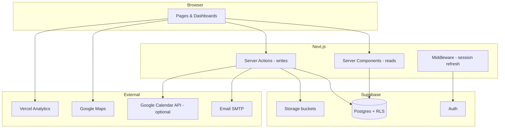
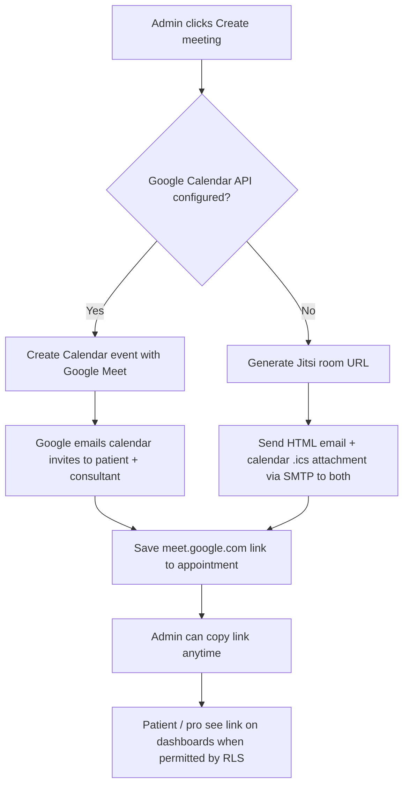
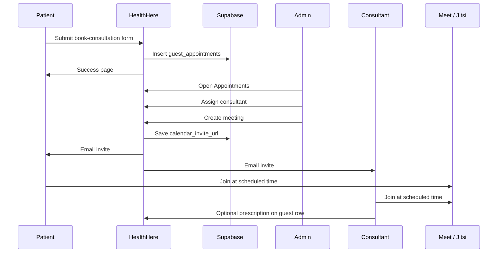
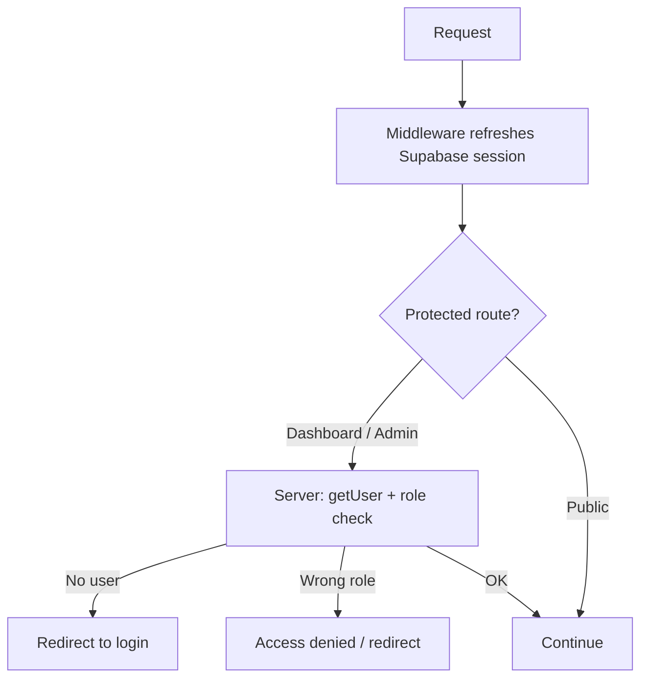
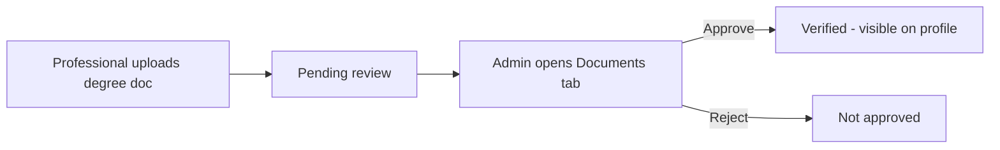

# HealthHere

**HealthHere** is a modern healthcare platform for discovering consultants, booking consultations, and managing patient and professional health records—all in one place. The product combines a public marketing site, role-based dashboards, and an admin operations panel, backed by Supabase and deployed on Next.js.

---

## How it works (quick overview)

Visitors browse services and consultants, then book a consultation **with or without an account**. Booking requests land in the database as **guest appointments**. Admins review them, assign a consultant, and can create a **video meeting** in one click: invites go to the patient and consultant by email, and the meeting link is stored on that appointment.

| Area | What happens |
|------|----------------|
| **Public site** | Marketing pages, consultant directory, contact form, newsletter signup, AI assistant |
| **Booking** | Guest fills the consultation form → confirmation page → optional account link later |
| **Patient dashboard** | Profile, medical history, medications, documents, insurance, own bookings |
| **Professional dashboard** | Profile, qualifications, weekly availability, clients, appointments, prescriptions for assigned guests |
| **Admin panel** | Users, professionals, appointments, clinical records, newsletter, enquiries, notifications |
| **Meetings** | Admin creates link + sends invites (Google Meet if Calendar API is configured; otherwise Jitsi + email) |

---

## Table of contents

1. [Technology stack](#technology-stack)
2. [Who uses the platform](#who-uses-the-platform)
3. [High-level architecture](#high-level-architecture)
4. [Application modules](#application-modules)
5. [Core workflows](#core-workflows)
6. [Data & security](#data--security)
7. [Integrations & services](#integrations--services)
8. [Project layout](#project-layout)
9. [Environment configuration](#environment-configuration)
10. [Running the project](#running-the-project)
11. [Related documentation](#related-documentation)

---

## Technology stack

| Layer | Choice |
|-------|--------|
| Framework | Next.js 15 (App Router) |
| Language | TypeScript |
| UI | React 19, Tailwind CSS 4, Shadcn / Radix UI, Framer Motion |
| Typography | Inter (body), Manrope (headings) |
| Backend & database | Supabase (Auth, Postgres, Storage, Row Level Security) |
| Mutations | Next.js Server Actions with Zod validation |
| Email | Nodemailer (Gmail SMTP) |
| Video meetings | Google Calendar API + Meet (optional) or Jitsi (fallback) |
| Maps | Google Maps / Places |
| Analytics | Vercel Analytics (on Vercel deployments) |
| Hosting | Vercel (typical deployment) |

---

## Who uses the platform

| Role | Access | Primary goals |
|------|--------|----------------|
| **Visitor** | Public pages, guest booking, contact, newsletter | Find care, book a consultation, learn about services |
| **Client** | `/dashboard` (client view) | Manage health profile, documents, and consultation requests |
| **Professional** | `/dashboard` (professional view) | Manage availability, clients, appointments, qualifications, guest prescriptions |
| **Admin** | `/application/enter/*` | Operate the platform: users, bookings, content, campaigns, enquiries |

Role is stored on the `users` table (`client`, `professional`, `admin`). Middleware refreshes the Supabase session on each request; protected routes rely on server-side auth checks and RLS policies.

---

## High-level architecture

**Design principles**

- **Supabase-first**: Auth, data, and file storage live in Supabase; the app does not add separate REST APIs for mutations when a Server Action suffices.
- **Security at the database**: Row Level Security limits what each role can read or write, even if the UI is bypassed.
- **Server-side trust**: Sensitive actions validate the signed-in user on the server (`getUser()`), not only from client session claims.

---

## Application modules

### Public website

Marketing and trust content for patients and professionals.

| Section | Purpose |
|---------|---------|
| Home | Hero, services highlight, specialties, newsletter |
| About / How it works / Services | Brand story and care journey |
| Consultants | Searchable directory of verified professionals |
| Consultant profile | Bio, fees, location, **Book** deep link (`?cref=` ties booking to that consultant) |
| Book consultation | Multi-step guest form (patient details, location, slot, message) |
| Booking success | Confirmation using a secure appointment reference |
| Contact | Enquiry form stored for admin review |
| Support, Terms, Privacy, Accessibility | Legal and help content |
| Login / Register | Supabase Auth; rate-limited sign-up and sign-in |

**HealthHere Assistant** — contextual help on public and dashboard pages (suggested questions, links into booking and dashboard).

---

### Guest consultation booking

Anyone can submit a booking **without logging in**.

**Captured data:** name, age, phone, email, specialty category, state/city, preferred date and time, optional message. If the user came from a consultant link, `professional_id` is set automatically.

**After submit:** row in `guest_appointments`, redirect to success page. Rate limits apply per IP, device, and email (see [docs/RATE_LIMITS.md](./docs/RATE_LIMITS.md)).

Logged-in clients can later see bookings that match their account email on the client dashboard.

---

### Client dashboard (`/dashboard`)

Single entry point; the UI switches based on `users.role`.

**Clients manage:**

- Profile and contact details  
- Medical profile (demographics, emergency contact)  
- Medical history conditions  
- Medications  
- Uploaded medical documents (Supabase Storage)  
- Insurance information  
- **Consultation requests** — guest bookings linked by email, including meeting link when admin has created one  

---

### Professional dashboard (`/dashboard`)

**Professionals manage:**

- Public profile and professional details (specialization, license, bio, fees)  
- Qualifications and degree documents (upload → admin review → verified badge)  
- **Weekly availability** — recurring slots by day of week  
- **Calendar view** — availability vs. fixed appointments  
- Registered **appointments** and **consultation requests** with clients  
- **Guest bookings assigned to them** — read details, write **prescription** (rich HTML), view meeting URL when set  

Activity (e.g. new calendar slot) can surface as in-app notifications.

---

### Admin panel (`/application/enter`)

Restricted to users with `role = admin`. Glass-style sidebar navigation.

| Module | Functionality |
|--------|----------------|
| **Dashboard** | Overview counts and quick insight |
| **Notifications** | System events (newsletter, signups, etc.) with date filters |
| **Users** | CRUD for accounts (client / professional / admin) |
| **Professionals** | Extended professional profile fields, verification flag |
| **Appointments** | Guest booking queue: search, assign consultant, **create meeting**, copy link, delete |
| **Medical history** | View/edit records across users |
| **Medications** | View/edit prescriptions list per user |
| **Documents** | Medical uploads + **qualification review** workflow |
| **Insurance** | Insurance records per client |
| **Newsletter** | Subscriber list, status, ban/resubscribe |
| **Campaigns** | Rich-email broadcasts to subscribers (Lexical editor) |
| **Enquiries** | Contact form submissions |

All mutations go through **admin Server Actions** with Zod schemas and `requireAdmin()` checks.

---

### Meeting & calendar invites (admin appointments)

This is the flow for turning a guest booking into a live video consultation.

**Prerequisites**

1. Guest row has a valid **patient email**.  
2. Admin has **assigned a consultant** with an email on file.  
3. No meeting link saved yet (`calendar_invite_url` empty).

**One-click action (calendar icon on the appointments table)**

| Mode | Meeting link | Invites |
|------|----------------|---------|
| **Google configured** | Real `meet.google.com` URL from Calendar API | Sent by Google (`sendUpdates: all`) |
| **Fallback** | Stable Jitsi room per appointment | Sent by HealthHere SMTP with join link + ICS file |

**Optional Google setup** — requires `GOOGLE_CALENDAR_CLIENT_ID`, `GOOGLE_CALENDAR_CLIENT_SECRET`, and `GOOGLE_CALENDAR_REFRESH_TOKEN` in environment (Calendar API enabled in Google Cloud). Without these, the platform still works using Jitsi + email.

Appointment times for guest slots are interpreted as **India Standard Time (IST)** when building calendar events.

---

### Newsletter & email

| Feature | Behavior |
|---------|----------|
| Footer / home subscribe | Adds to `newsletter_subscribers`; welcome email via SMTP |
| Unsubscribe | Tokenized one-click page (`/unsubscribe`); RFC 8058 headers on marketing mail |
| Admin campaigns | Compose HTML, send broadcast, archive in `newsletter_campaigns` with per-recipient delivery rows |
| Rate limits | Separate buckets for subscribe vs. register vs. login (documented in [docs/RATE_LIMITS.md](./docs/RATE_LIMITS.md)) |

---

### Consultant deep linking

Professionals share booking URLs that include an encoded consultant reference (`cref`). The booking form pre-selects that professional so the guest request is tied to them from the start—useful for marketing and repeat patients.

---

## Core workflows

### End-to-end: from booking to video call

### Authentication & session

- Registration creates `auth.users` and syncs a row in `public.users` via database trigger.  
- Admins are not self-service; an existing admin sets `role = admin`.

### Qualification verification (professionals)

---

## Data & security

### Main data domains

| Domain | Tables (conceptual) | Notes |
|--------|---------------------|--------|
| Identity | `users` (+ Supabase `auth.users`) | Role, profile, phone |
| Guest bookings | `guest_appointments` | Public insert; scoped select for patient email / assigned pro / admin |
| Scheduling | `appointments`, `professional_availability`, `consultation_requests` | Registered users |
| Clinical | `client_medical_profiles`, `medical_history`, `medications`, `medical_documents` | Client-owned; admin override |
| Professionals | `professional_profiles`, `professional_qualifications` | Verification workflow |
| Comms | `newsletter_subscribers`, `newsletter_campaigns`, `contact_enquiries` | Marketing & support |
| Ops | `admin_notifications`, rate limit buckets | Internal visibility |

Schema source of truth: **`SUPABASE_SETUP.sql`** (initial) and **`updates.sql`** (incremental migrations you apply in Supabase SQL editor).

### Row Level Security (RLS)

- Enabled on sensitive tables.  
- **Clients** see and edit their own rows.  
- **Professionals** see assigned guest bookings and their clients’ appointment data.  
- **Admins** have elevated policies for operational tables.  
- **Anonymous** users can insert guest appointments and use specific RPCs (e.g. booking success lookup by UUID).

### Storage buckets

- Profile images  
- Medical documents (client uploads)  
- Qualification documents (professional uploads)  

Access is enforced with storage policies aligned to user ownership and admin review needs.

---

## Integrations & services

| Service | Used for |
|---------|----------|
| **Supabase** | Auth, Postgres, RLS, Storage, realtime-capable client |
| **SMTP (Gmail)** | Newsletter, consultation invite emails (fallback path), broadcasts |
| **Google Calendar API** | Optional real Google Meet links + native calendar invites |
| **Jitsi** | Fallback video rooms when Google is not configured |
| **Google Maps / Places** | Location autocomplete and maps on booking |
| **Vercel Analytics** | Web vitals and traffic (when deployed on Vercel) |

---

## Project layout

High-level folders (no implementation detail):

| Path | Responsibility |
|------|----------------|
| `src/app/` | Routes: marketing pages, `book-consultation`, `dashboard`, `application/enter` admin |
| `src/features/` | Server Actions grouped by domain (`admin`, `client`, `professional`, `assistant`, `profile`) |
| `src/components/` | Shared UI, layout chrome, assistant, marketing sections |
| `src/lib/` | Supabase clients, mailer, calendar/meeting helpers, SEO, utilities |
| `docs/` | Rate limits, analytics runbooks |
| `SUPABASE_SETUP.sql` | Full database bootstrap |
| `updates.sql` | Patches to apply after initial setup |
| `middleware.ts` | Session refresh for all matched routes |

Coding standards for contributors: **`src/DEVELOPMENT_RULES.md`** and **`.cursor/rules`** in the repo.

---

## Environment configuration

Variables commonly required (names only—set values in `.env` locally and in Vercel):

| Variable | Purpose |
|----------|---------|
| `NEXT_PUBLIC_SUPABASE_URL` | Supabase project URL |
| `NEXT_PUBLIC_SUPABASE_ANON_KEY` | Supabase anonymous key |
| `SMTP_USER` / `SMTP_PASS` | Outbound email |
| `SMTP_FROM_NAME` | Sender display name |
| `APP_URL` | Public site URL for links in emails |
| `NEWSLETTER_UNSUBSCRIBE_SECRET` | HMAC for unsubscribe tokens |
| `NEXT_PUBLIC_GOOGLE_MAPS_API_KEY` | Maps on booking |
| `GOOGLE_PLACES_API_KEY` | Places autocomplete (server) |
| `GOOGLE_CALENDAR_CLIENT_ID` | Optional Meet integration |
| `GOOGLE_CALENDAR_CLIENT_SECRET` | Optional Meet integration |
| `GOOGLE_CALENDAR_REFRESH_TOKEN` | Optional Meet integration |
| `GOOGLE_CALENDAR_REDIRECT_URI` | Optional OAuth redirect |

---

## Running the project

**Prerequisites:** Node.js 20+, a Supabase project with schema applied, and SMTP credentials for email features.

1. Clone the repository and install dependencies: `npm install`  
2. Copy environment variables into `.env` (see table above).  
3. Apply `SUPABASE_SETUP.sql` in the Supabase SQL editor, then any pending `updates.sql` scripts.  
4. Start development: `npm run dev`  
5. Open [http://localhost:3000](http://localhost:3000)

**Production:** Deploy to Vercel (or similar), set the same environment variables, and ensure `APP_URL` matches the live domain.

---

## Related documentation

| Document | Contents |
|----------|----------|
| [docs/RATE_LIMITS.md](./docs/RATE_LIMITS.md) | Sign-up, login, newsletter, booking, contact limits |
| [docs/ANALYTICS_AND_MONITORING.md](./docs/ANALYTICS_AND_MONITORING.md) | Vercel Analytics |
| [src/DEVELOPMENT_RULES.md](./src/DEVELOPMENT_RULES.md) | Server Actions, Zod, RLS, UI conventions |

---

## Visual identity

HealthHere uses a **premium healthcare** aesthetic: soft teals, glassmorphism panels, rounded-xl surfaces, and subtle Framer Motion transitions. Icons are from Lucide React. The experience is designed to feel calm, trustworthy, and spacious on both desktop and mobile—including a bottom navigation bar for the admin panel on small screens.

---

*HealthHere — connecting patients and consultants with secure booking, records, and video care.*
