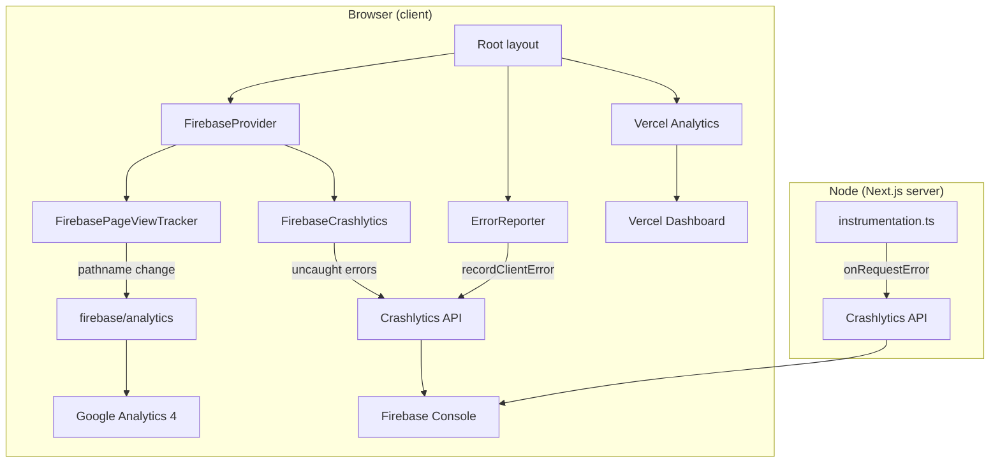

# Analytics & Monitoring — Implementation Guide (HealthHere)

**Last updated:** 2026-05-29  
**Status:** Implemented in production codebase  
**Stack:** Next.js 15 App Router · Vercel hosting · Supabase auth

This document describes **what was built**, **how it works**, and **how to operate it**. For the original planning notes and GA4 funnel ideas, see [FIREBASE_ANALYTICS.md](./FIREBASE_ANALYTICS.md).

---

## Table of contents

1. [Summary](#1-summary)
2. [What runs on the site](#2-what-runs-on-the-site)
3. [Architecture](#3-architecture)
4. [File map](#4-file-map)
5. [Startup & page-view flow](#5-startup--page-view-flow)
6. [Crashlytics flow](#6-crashlytics-flow)
7. [Environment variables](#7-environment-variables)
8. [Privacy & data rules](#8-privacy--data-rules)
9. [Adding custom events](#9-adding-custom-events)
10. [Verification & debugging](#10-verification--debugging)
11. [Deployment checklist](#11-deployment-checklist)
12. [Troubleshooting](#12-troubleshooting)

---

## 1. Summary

HealthHere uses **three complementary tools**:

| Tool | Package | Purpose |
|------|---------|---------|
| **Vercel Analytics** | `@vercel/analytics` | Traffic and Web Vitals on Vercel deployments (unchanged from before). |
| **Firebase Analytics (GA4)** | `firebase` | Page views on every route change + optional custom product events. |
| **Firebase Crashlytics** | `@firebase/crashlytics` (web EAP) | Client crashes and server route errors. |

**Decisions made:**

- **No cookie consent banner** — analytics starts when the app loads. Users are informed in the [Privacy Policy](/privacy) (section 2, “Analytics and diagnostics”).
- **No feature-flag env vars** — Firebase Analytics runs whenever `NEXT_PUBLIC_FIREBASE_MEASUREMENT_ID` is set; Crashlytics runs when core Firebase env vars are set.
- **Vercel Analytics kept** — both Vercel and Firebase run in parallel.

---

## 2. What runs on the site

### 2.1 Vercel Analytics

- **Where:** `src/app/layout.tsx` — `<Analytics />` from `@vercel/analytics/next`.
- **When:** Automatically on Vercel-hosted builds.
- **Data:** Page views, referrers, Web Vitals (LCP, FID, CLS, etc.) in the Vercel dashboard.
- **Config:** No extra env vars in this repo; tied to the Vercel project.

### 2.2 Firebase Analytics (Google Analytics 4)

- **Where:** `FirebaseProvider` + `src/lib/firebase/analytics.ts`.
- **When:** After Firebase initializes in the browser, on **every client-side navigation** (including the first page).
- **Event:** `page_view` with `page_path`, `page_title`, `page_location`.
- **Requires:** `NEXT_PUBLIC_FIREBASE_MEASUREMENT_ID` (GA4 measurement ID, e.g. `G-XXXXXXXX`).

### 2.3 Firebase Crashlytics

**Client**

- `<FirebaseCrashlytics />` from `@firebase/crashlytics/react` registers global listeners for uncaught errors and unhandled promise rejections.
- `ErrorReporter` also calls `recordClientError()` for:
  - Errors inside iframes (dev tooling),
  - The Next.js `global-error` boundary when a fatal UI error occurs.

**Server**

- `src/instrumentation.ts` exports `onRequestError` via `nextOnRequestError()` so uncaught errors in **App Router server routes** are reported to Firebase.

---

## 3. Architecture



**Important:** All Firebase Analytics and client Crashlytics code runs **only in the browser**. Server code only initializes the Firebase app for Crashlytics reporting via `instrumentation.ts`.

---

## 4. File map

```
src/
├── app/
│   ├── layout.tsx                    # Mounts <Analytics /> + <FirebaseProvider />
│   ├── global-error.tsx              # Uses ErrorReporter (Crashlytics on fatal error)
│   └── privacy/PrivacyPageContent.tsx # Legal disclosure for all three tools
├── components/
│   ├── firebase/
│   │   └── FirebaseProvider.tsx      # Init app, Crashlytics, page-view tracker
│   └── ErrorReporter.tsx             # Existing reporter + recordClientError()
├── instrumentation.ts                # Server Firebase init + onRequestError
└── lib/
    └── firebase/
        ├── config.ts                 # Reads NEXT_PUBLIC_FIREBASE_* env
        ├── app.ts                    # Singleton initializeApp (client)
        ├── analytics.ts              # page_view, trackEvent, path sanitization
        └── crashlytics.ts            # recordClientError helper

docs/
├── ANALYTICS_AND_MONITORING.md       # This file
└── FIREBASE_ANALYTICS.md             # Original plan + funnel ideas

.env.example                          # Firebase env template
```

### Module responsibilities

| Module | Role |
|--------|------|
| `config.ts` | Builds Firebase config from env. Returns `null` if `apiKey`, `projectId`, or `appId` missing. |
| `app.ts` | Client-only singleton `getFirebaseApp()` — one `initializeApp` per tab. |
| `analytics.ts` | Lazy `getAnalytics()`, `trackPageView()`, `trackEvent()`, redacts sensitive query params. |
| `crashlytics.ts` | Lazy `getCrashlytics()`, `recordClientError()` for manual reporting. |
| `FirebaseProvider.tsx` | Wires init + Crashlytics component + route listener inside `Suspense`. |
| `instrumentation.ts` | Server: `register()` initializes Firebase app; `onRequestError` hooks Next.js errors. |

---

## 5. Startup & page-view flow

### Step-by-step (every visit)

1. User loads any page → `RootLayout` renders.
2. **`ErrorReporter`** mounts (no UI on normal pages).
3. **`Analytics`** (Vercel) loads its script.
4. **`FirebaseProvider`** mounts:
   - If `isFirebaseConfigured()` is false → renders nothing (safe no-op).
   - Otherwise `getFirebaseApp()` runs `initializeApp(config)`.
   - `initFirebaseAnalytics()` prepares the Analytics instance (if `measurementId` exists and browser supports it).
   - `<FirebaseCrashlytics firebaseApp={app} />` attaches global error listeners.
5. **`FirebasePageViewTracker`** (inside `Suspense` because it uses `usePathname()`):
   - On mount and on every `pathname` change → `trackPageView(pathname)`.
6. `trackPageView` sends GA4 event:

```ts
logEvent(analytics, "page_view", {
  page_path: safePath,      // e.g. "/book-consultation"
  page_title: document.title,
  page_location: safeHref,  // full URL with sensitive query params redacted
});
```

### Query parameter sanitization

Before sending paths/URLs, these query keys are redacted:

`email`, `token`, `code`, `password`, `access_token`, `refresh_token`, `name`, `phone`

Example: `/register?email=user@x.com` → `/register?email=redacted`

### When Analytics does **not** run

- Missing `NEXT_PUBLIC_FIREBASE_MEASUREMENT_ID`
- Missing required Firebase env (`apiKey`, `projectId`, `appId`)
- Browser does not support Analytics (`isSupported()` returns false — rare)
- User blocks Google/Firebase scripts (ad blockers)

The app continues to work normally; only telemetry is skipped.

---

## 6. Crashlytics flow

### Automatic (client)

`FirebaseCrashlytics` registers listeners near the React root. Uncaught errors and unhandled promise rejections are sent to Firebase without extra code in feature components.

### Manual (client)

```ts
import { recordClientError } from "@/lib/firebase/crashlytics";

try {
  await riskyClientAction();
} catch (error) {
  recordClientError(error, { source: "booking-wizard", step: "payment" });
}
```

Use **non-PHI** attribute keys/values only (see §8).

### Global error page

`src/app/global-error.tsx` re-exports `ErrorReporter` with an `error` prop. When Next.js shows the fatal error UI, `recordClientError` runs with `source: "global-error"` and the error `digest`.

### Server route errors

`src/instrumentation.ts`:

```ts
export async function register() {
  ensureServerFirebaseApp(); // initializeApp once on server
}

export const onRequestError = nextOnRequestError({
  appVersion: "healthere-redesign",
});
```

Next.js calls `onRequestError` when a Server Component, Server Action, or route handler throws. Reports appear in Firebase Console → Crashlytics (may take a few minutes).

### Crashlytics vs Analytics

| | Analytics | Crashlytics |
|---|-----------|-------------|
| **Needs measurement ID** | Yes | No |
| **Needs apiKey + projectId + appId** | Yes | Yes |
| **Runs on server** | No | Yes (`instrumentation.ts`) |

---

## 7. Environment variables

Copy from `.env.example` into `.env.local` (local) and Vercel project settings (production).

| Variable | Required | Used for |
|----------|----------|----------|
| `NEXT_PUBLIC_FIREBASE_API_KEY` | Yes | Firebase app init |
| `NEXT_PUBLIC_FIREBASE_PROJECT_ID` | Yes | Firebase app init |
| `NEXT_PUBLIC_FIREBASE_APP_ID` | Yes | Firebase app init |
| `NEXT_PUBLIC_FIREBASE_MEASUREMENT_ID` | For Analytics only | GA4 / Firebase Analytics |
| `NEXT_PUBLIC_FIREBASE_AUTH_DOMAIN` | No | Defaults to `{projectId}.firebaseapp.com` |
| `NEXT_PUBLIC_FIREBASE_STORAGE_BUCKET` | No | Defaults to `{projectId}.appspot.com` |
| `NEXT_PUBLIC_FIREBASE_MESSAGING_SENDER_ID` | No | Defaults to empty string |

**Where to get values:** Firebase Console → Project settings → Your apps → Web app → SDK setup and configuration.

**Example (structure only):**

```env
NEXT_PUBLIC_FIREBASE_API_KEY=AIza...
NEXT_PUBLIC_FIREBASE_AUTH_DOMAIN=your-project.firebaseapp.com
NEXT_PUBLIC_FIREBASE_PROJECT_ID=your-project
NEXT_PUBLIC_FIREBASE_APP_ID=1:123456789:web:abc...
NEXT_PUBLIC_FIREBASE_MEASUREMENT_ID=G-XXXXXXXXXX
```

---

## 8. Privacy & data rules

### Legal disclosure

Privacy Policy section **“2. How we use information”** (`PrivacyPageContent.tsx`) states that HealthHere uses:

- Firebase Analytics  
- Firebase Crashlytics  
- Vercel Analytics  

…and that these tools must not receive PHI.

### No consent banner

Analytics and Crashlytics initialize on page load when env vars are present. There is no opt-in UI. If legal requirements change (e.g. EU strict consent), a banner would need to be added and init gated behind user choice.

### Do not send (ever)

- Names, emails, phones, addresses  
- Medical history, symptoms, diagnoses, prescriptions  
- Insurance IDs or policy numbers  
- Raw form field values or chat content  
- Plain Supabase user UUIDs (use coarse enums or omit)

### Safe to send

- `page_path`, `page_title` (sanitized)  
- Event names like `cta_click`, `booking_step`  
- Coarse enums: `role: "patient"`, `step: "2"`  
- UTM parameters (if not containing PII)  
- Crash stack traces (avoid logging user input in error messages)

---

## 9. Adding custom events

Use the shared helper from any **client component**:

```ts
"use client";

import { trackEvent } from "@/lib/firebase/analytics";

async function onBookingComplete() {
  await trackEvent("booking_complete", {
    booking_type: "guest",
    step_count: 4,
  });
}
```

**Suggested events** (not all wired yet — add as product needs them):

| Event | When | Example params |
|-------|------|----------------|
| `cta_click` | Hero/footer CTA click | `cta_name`, `location` |
| `begin_booking` | Book consultation page open | `source` |
| `booking_step` | Wizard step change | `step_index`, `step_name` |
| `booking_complete` | Success page | `booking_type` |
| `sign_up_complete` | Register success | `method` |
| `login` | Login success | `method` |
| `contact_submit` | Contact form success | `topic` |

Custom events appear in Firebase Console → Analytics → Events (and linked GA4 property).

---

## 10. Verification & debugging

### Console diagnostics (development)

With `npm run dev`, the browser and terminal log **`[HealthHere Firebase]`** messages that show:

- Which `NEXT_PUBLIC_FIREBASE_*` env vars are present (secrets masked)
- Whether the Firebase app, Analytics, and Crashlytics initialized
- Each `page_view` when logging is enabled
- Why Analytics or Crashlytics was skipped (missing env, ad blocker / `isSupported()`, etc.)

Optional: set `NEXT_PUBLIC_FIREBASE_DEBUG=true` in `.env` to force logs in production builds, or `NEXT_PUBLIC_FIREBASE_DEBUG=false` to silence them during local dev.

### Firebase Analytics (GA4)

1. Firebase Console → **Analytics** → **DebugView** (or GA4 → Configure → DebugView).  
2. Install [Google Analytics Debugger](https://chrome.google.com/webstore/detail/google-analytics-debugger) Chrome extension, or add `debug_mode` in dev if you extend the SDK later.  
3. Run `npm run dev`, navigate between pages (`/`, `/book-consultation`, `/login`).  
4. Confirm `page_view` events with correct `page_path`.

### Network check

DevTools → **Network** → filter `google-analytics` or `firebase`. After navigation you should see requests when env is configured.

### Vercel Analytics

Vercel dashboard → Project → **Analytics** tab (production traffic only).

### Crashlytics

1. Firebase Console → **Crashlytics** → enable for the web app if prompted.  
2. Trigger a test error in dev (temporary button or `throw new Error("Crashlytics test")` in a client component).  
3. Reports can take **5–15 minutes** to appear.  
4. Note: Web Crashlytics uses the **EAP** package `@firebase/crashlytics` — ensure the Firebase project supports web crash reporting.

### Build

```bash
npm run build
npm run start
```

Build may show a webpack warning from `@protobufjs/inquire` (OpenTelemetry dependency of Crashlytics). This is expected and does not fail the build.

---

## 11. Deployment checklist

- [ ] Firebase web app created; env vars set in **Vercel** (all environments that should report).  
- [ ] GA4 property linked to Firebase project.  
- [ ] Crashlytics enabled in Firebase Console.  
- [ ] `NEXT_PUBLIC_FIREBASE_MEASUREMENT_ID` set for Analytics.  
- [ ] Privacy Policy deployed with analytics section.  
- [ ] Smoke test: production URL → navigate 3 pages → check GA4 Realtime.  

---

## 12. Troubleshooting

| Symptom | Likely cause | Fix |
|---------|----------------|-----|
| No Firebase events | Missing env on Vercel | Add vars; redeploy |
| No `page_view` only | Missing `MEASUREMENT_ID` | Set `NEXT_PUBLIC_FIREBASE_MEASUREMENT_ID` |
| Works locally, not prod | Env only in `.env.local` | Add to Vercel |
| Ad blocker | Script blocked | Expected; use GA4 Realtime from unblocked browser |
| Duplicate page views | GA4 enhanced measurement + manual `page_view` | Disable enhanced measurement page views in GA4 admin, or remove manual tracking (we use manual only) |
| Crashlytics empty | EAP / project not enabled | Enable Crashlytics in console; wait 15 min |
| Server errors not reported | `instrumentation.ts` not running | Ensure Next.js 15 picks up `src/instrumentation.ts`; check build logs |

---

## Related docs

- [FIREBASE_ANALYTICS.md](./FIREBASE_ANALYTICS.md) — Original planning, funnel ideas, phased rollout  
- [RATE_LIMITS.md](./RATE_LIMITS.md) — API rate limiting (separate from analytics)  
- [Privacy Policy](/privacy) — User-facing legal text  

---

## Changelog

| Date | Change |
|------|--------|
| 2026-05-29 | Initial implementation: Firebase Analytics, Crashlytics, Vercel Analytics; no consent banner; privacy policy updated |
| 2026-05-29 | Removed `NEXT_PUBLIC_FIREBASE_ANALYTICS_ENABLED` / `_DEV` feature flags |
