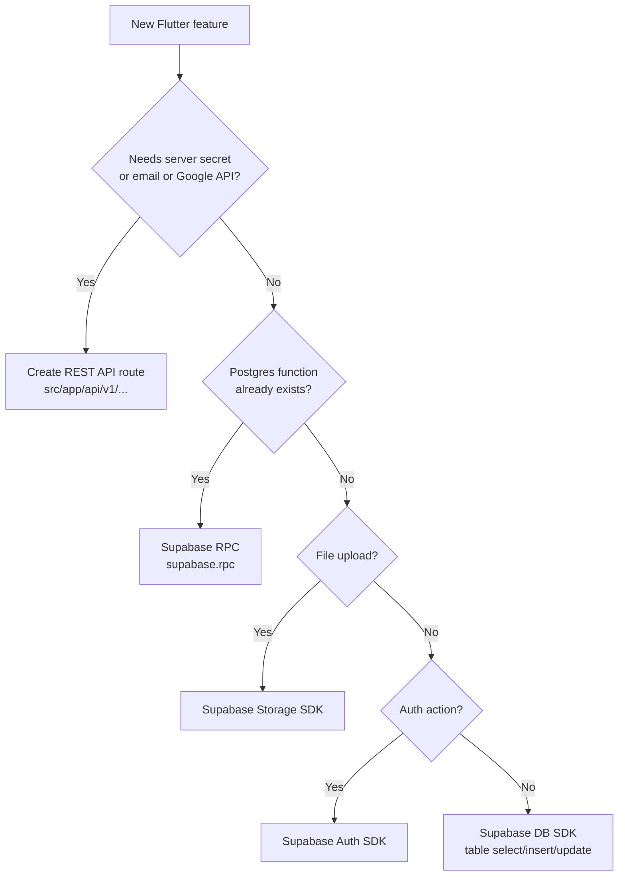

# HealthHere — Flutter App & API Planning

> Planning document for extending the existing Next.js + Supabase web app with a **mobile API layer** and a **Flutter client**.  
> Based on the current codebase at `c:\CodeBase\healthcare`.

---

## Table of Contents

1. [Executive Summary](#1-executive-summary)
2. [Current Architecture (Web)](#2-current-architecture-web)
3. [API Strategy](#3-api-strategy)
4. [SDK vs API — Decision Guide](#4-sdk-vs-api--decision-guide)
5. [Flutter Screens — Complete List](#5-flutter-screens--complete-list)
6. [Screen-by-Screen API Mapping](#6-screen-by-screen-api-mapping)
7. [Proposed API Endpoints (Build List)](#7-proposed-api-endpoints-build-list)
8. [Flutter App Architecture](#8-flutter-app-architecture)
9. [Design System & Theme](#9-design-system--theme)
10. [Smooth & Professional UX Guidelines](#10-smooth--professional-ux-guidelines)
11. [Phased Rollout](#11-phased-rollout)
12. [Project Structure](#12-project-structure)
13. [Security & Compliance](#13-security--compliance)
14. [Testing & Quality](#14-testing--quality)
15. [Open Decisions](#15-open-decisions)

---

## 1. Executive Summary

The HealthHere web app is a **Next.js 15 + Supabase** healthcare platform with three roles:

| Role | Web route | Mobile app |
|------|-----------|------------|
| **Client** (patient) | `/dashboard` | ✅ Full Flutter app |
| **Professional** (doctor) | `/dashboard` | ✅ Full Flutter app |
| **Admin** | `/application/enter` | ❌ **Not in mobile app** — web only |

> **Confirmed scope:** The Flutter app is **only for Client (patient) and Professional (doctor)**. No admin screens, no admin WebView, no `/api/v1/admin/*` routes. Admins use the **web app only** (`/application/enter`).

**Today:** All mutations go through **Next.js Server Actions** — there are **no REST API routes**. Flutter cannot call Server Actions directly.

**Recommended approach:** A **hybrid architecture**:

1. **Supabase Flutter SDK** for auth, RLS-protected reads/writes, storage uploads, and realtime (Phase 1 — fastest path).
2. **New Next.js API routes** (`src/app/api/v1/...`) only for server-only logic that cannot run on the client (Phase 2 — meetings, emails, PDFs, rate limits).

This keeps one backend (Supabase + existing Next.js server) and avoids duplicating business logic in a separate API server.

### Out of scope (mobile app)

| Item | Status |
|------|--------|
| Admin dashboard (`/application/enter`) | **Not in app** — web only |
| Admin screens (users, CMS, newsletter, etc.) | **Not in app** |
| Admin WebView / in-app browser for admin | **Not in app** |
| `/api/v1/admin/*` REST routes for mobile | **Will not be built** |
| Admin role in Flutter navigation | **Blocked** — show “use web” message + sign out |

Admin workflows stay on the existing Next.js web app and Server Actions (`src/features/admin/actions.ts`). No mobile work for admin.

### At a glance — do we build APIs?

| Integration type | Screens / features | Build new API? |
|------------------|-------------------|----------------|
| **Supabase Flutter SDK** (Auth, DB, Storage) | ~38 screens | **No** — use SDK directly |
| **Supabase RPC** (Postgres functions) | Newsletter, blog likes/views, guest confirm | **No** — call `supabase.rpc()` |
| **New REST API** (`/api/v1/...`) | Guest booking, meetings, email, Places, prescriptions | **Yes** — ~10 routes to create |
| **Static / local only** | Splash, legal pages, onboarding | **No** |
| ~~Admin (mobile)~~ | — | **Out of scope** — web only |

**Bottom line:** ~80% of the app uses the **Supabase SDK** with zero new backend. Only ~10 REST endpoints are needed for server-only work (secrets, email, Google APIs). **Zero admin APIs or screens.**

---

## 2. Current Architecture (Web)

```
┌─────────────────────────────────────────────────────────────┐
│                     Next.js 15 (App Router)                  │
│  ┌─────────────┐  ┌──────────────┐  ┌─────────────────────┐ │
│  │   Pages     │  │ Server       │  │  Supabase SSR       │ │
│  │   (RSC)     │──│ Actions      │──│  (auth + cookies)   │ │
│  └─────────────┘  └──────────────┘  └─────────────────────┘ │
└────────────────────────────┬────────────────────────────────┘
                             │
              ┌──────────────┴──────────────┐
              ▼                             ▼
     ┌─────────────────┐          ┌─────────────────┐
     │  Supabase Auth  │          │  Postgres + RLS │
     │  + Storage      │          │  (22 tables)    │
     └─────────────────┘          └─────────────────┘
```

### Key source files

| Area | Path |
|------|------|
| Theme tokens | `src/app/globals.css` |
| Dashboard theme | `src/app/dashboard/_components/dashboard-theme.ts` |
| Admin theme | `src/app/application/enter/_components/admin-theme.ts` |
| DB schema | `SUPABASE_SETUP.sql` |
| Auth | `src/lib/supabase/*`, `middleware.ts` |
| Client actions | `src/features/client/actions.ts` |
| Professional actions | `src/features/professional/actions.ts` |
| Admin actions | `src/features/admin/actions.ts` |
| Guest booking | `src/app/book-consultation/actions.ts` |

### Database tables (Flutter-relevant)

| Table | Client | Professional | Public read |
|-------|--------|--------------|-------------|
| `users` | own row | own row | limited (directory) |
| `client_medical_profiles` | CRUD own | read assigned | — |
| `medical_history` | CRUD own | read assigned | — |
| `medications` | CRUD own | read assigned | — |
| `medical_documents` | CRUD own | read assigned | — |
| `insurance` | CRUD own | — | — |
| `professional_profiles` | read verified | CRUD own | verified only |
| `professional_qualifications` | — | CRUD own | — |
| `professional_availability` | read | CRUD own | read for booking |
| `appointments` | CRUD own | CRUD own | — |
| `guest_appointments` | — | — | create (guest flow) |
| `blog_posts`, `blog_categories` | read | read | published only |
| `blog_comments`, `blog_post_likes` | CRUD own | CRUD own | read |

---

## 3. API Strategy

### 3.1 Three layers

```
┌──────────────────────────────────────────────────────────────┐
│                      Flutter App                              │
│  ┌────────────────┐  ┌────────────────┐  ┌───────────────┐ │
│  │ Supabase SDK   │  │ REST Client    │  │ Local cache   │ │
│  │ (auth, CRUD,   │  │ (server-only   │  │ (Hive/Drift)  │ │
│  │  storage, RT)  │  │  operations)   │  │               │ │
│  └───────┬────────┘  └───────┬────────┘  └───────────────┘ │
└──────────┼───────────────────┼──────────────────────────────┘
           │                   │
           ▼                   ▼
   ┌───────────────┐   ┌───────────────────────────┐
   │   Supabase    │   │  Next.js API v1           │
   │   (RLS)       │   │  src/app/api/v1/...       │
   └───────────────┘   │  Bearer: Supabase JWT     │
                       └───────────────────────────┘
```

### 3.2 What goes where

| Operation | Layer | Reason |
|-----------|-------|--------|
| Sign in / sign up / sign out | Supabase Auth SDK | Same as web |
| Read/write profile, medical data | Supabase + RLS | Policies already exist |
| Upload profile / medical docs | Supabase Storage | Buckets + RLS configured |
| Consultant directory | Supabase query | `professional_profiles` + RLS |
| Book appointment (logged-in) | Supabase insert | `appointments` table |
| Blog read, like, comment | Supabase | RLS covers engagement |
| Guest consultation booking | **API route** | Google Places, meeting pipeline, email |
| Create Google Meet / Jitsi link | **API route** | OAuth tokens server-side |
| Send prescription PDF email | **API route** | Nodemailer + HTML/PDF generation |
| Newsletter subscribe/unsubscribe | Supabase RPC + API | HMAC unsubscribe needs server |
| AI assistant context | **API route** | `src/features/assistant/actions.ts` |

### 3.3 API route conventions (new)

When adding routes under `src/app/api/v1/`:

- **Auth:** Validate `Authorization: Bearer <supabase_access_token>` via `supabase.auth.getUser(token)`.
- **Validation:** Reuse existing Zod schemas from `src/features/*/actions.ts` — extract schemas to shared `src/lib/schemas/` to avoid duplication.
- **Response shape:**

```json
{
  "success": true,
  "data": { },
  "error": null
}
```

- **Errors:** HTTP status + `{ "success": false, "error": { "code": "...", "message": "..." } }`.
- **Versioning:** Prefix all routes with `/api/v1/`.
- **Rate limiting:** Reuse `src/lib/device-rate-limit.ts` patterns.

---

## 4. SDK vs API — Decision Guide

Use this flow for every feature before writing code.

### 4.1 Four integration types

| Type | Package | When to use | Build API? |
|------|---------|-------------|------------|
| **A. Supabase Auth SDK** | `supabase_flutter` | Login, register, logout, password reset, session refresh | **No** |
| **B. Supabase Database SDK** | `supabase_flutter` | CRUD on tables where RLS policies already exist | **No** |
| **C. Supabase Storage SDK** | `supabase_flutter` | Profile photos, medical docs, qualification uploads | **No** |
| **D. Supabase RPC** | `supabase_flutter` | Logic already in Postgres (`subscribe_newsletter`, `toggle_blog_post_like`, etc.) | **No** |
| **E. REST API (new)** | `dio` → `/api/v1/...` | Server secrets, third-party APIs, email, PDF generation, rate limits | **Yes — must create** |
| **F. WebView** | `webview_flutter` | Lexical prescription editor only (short-term, Phase 3) | **No** — use existing web page if needed |

### 4.2 Decision flowchart



### 4.3 What you do NOT need to build

These are common mistakes — **do not** create REST APIs for:

| Feature | Wrong approach | Correct approach |
|---------|----------------|------------------|
| User profile read/update | `GET /api/users/me` | `supabase.from('users').select().eq('id', uid)` |
| Medical history CRUD | Custom REST endpoints | `supabase.from('medical_history')` + RLS |
| Appointment list | Custom REST endpoints | `supabase.from('appointments')` + joins |
| Consultant directory | Custom REST endpoints | `supabase.from('professional_profiles').eq('is_verified', true)` |
| Profile image upload | Multipart REST upload | `supabase.storage.from('profiles').upload()` |
| Blog post list | Custom REST endpoints | `supabase.from('blog_posts').eq('status', 'published')` |
| Sign in / sign up | Custom auth API | `supabase.auth.signInWithPassword()` |

RLS in `SUPABASE_SETUP.sql` already enforces who can read/write each row — the SDK respects it automatically when the user is logged in.

### 4.4 What you MUST build (REST API)

Only when logic lives in Next.js Server Actions and touches secrets:

| Reason | Examples from codebase |
|--------|------------------------|
| **API keys hidden on server** | Google Places search (`searchPlaces`) |
| **OAuth tokens on server** | Google Calendar / Meet (`createConsultationMeeting`) |
| **Email sending** | Guest booking emails, prescription PDF (`mailer.ts`) |
| **HMAC / signed tokens** | Newsletter unsubscribe (`unsubscribeNewsletter`) |
| **Device rate limiting** | Contact form, auth (`device-rate-limit.ts`) |
| **Multi-step server pipeline** | Guest meeting pipeline (`guestMeetingPipeline.ts`) |
| **External data proxy** | University search (`searchUniversities` — GitHub gist) |

### 4.5 Supabase RPC functions (call via SDK — no REST needed)

Already in `SUPABASE_SETUP.sql` — use `supabase.rpc('name', params)`:

| RPC function | Used by screen |
|--------------|----------------|
| `subscribe_newsletter` | Newsletter signup |
| `get_newsletter_status` | Newsletter status |
| `set_newsletter_status` | Unsubscribe (with email) |
| `get_guest_appointment_confirmation` | Booking success screen |
| `toggle_blog_post_like` | Blog post like button |
| `increment_blog_post_view` | Blog post view tracking |
| `try_newsletter_rate_limit` | Newsletter (server-side in API if needed) |

### 4.6 Flutter code pattern per type

```dart
// A/B/C — Supabase SDK (most screens)
final profile = await supabase.from('users').select().eq('id', userId).single();
await supabase.from('medical_history').insert({...});
await supabase.storage.from('profiles').upload(path, file);

// D — Supabase RPC
await supabase.rpc('subscribe_newsletter', params: {'p_email': email});
await supabase.rpc('toggle_blog_post_like', params: {'p_post_id': postId, 'p_user_id': userId});

// E — REST API (only for server-only features)
final dio = ref.read(dioProvider); // attaches Bearer token
final res = await dio.post('/api/v1/booking/guest', data: formData);
```

---

## 5. Flutter Screens — Complete List

**Total: 49 screens** — Client + Professional + public only. **No admin screens.**

Mirrors web routes under `src/app/` (excluding `/application/enter/*`).

### 5.1 App shell & auth (7 screens)

| # | Screen | Flutter route | Phase | Auth |
|---|--------|---------------|-------|------|
| 1 | Splash | `/` | 1 | — |
| 2 | Onboarding (3 slides) | `/onboarding` | 1 | — |
| 3 | Login | `/login` | 1 | — |
| 4 | Register | `/register` | 1 | — |
| 5 | Register role picker (client / professional) | `/register/role` | 1 | — |
| 6 | Forgot password | `/forgot-password` | 1 | — |
| 7 | Reset password (deep link) | `/reset-password` | 1 | — |

### 5.2 Public / marketing (11 screens)

| # | Screen | Flutter route | Web equivalent | Phase |
|---|--------|---------------|----------------|-------|
| 8 | Home | `/home` | `/` | 2 |
| 9 | About | `/about` | `/about` | 3 |
| 10 | Services | `/services` | `/services` | 3 |
| 11 | How it works | `/how-it-works` | `/how-it-works` | 3 |
| 12 | Specialists | `/specialists` | `/specialists` | 2 |
| 13 | Consultants directory | `/consultants` | `/consultants` | 1 |
| 14 | Consultant detail | `/consultants/:id` | `/consultants/[id]` | 1 |
| 15 | Contact | `/contact` | `/contact` | 2 |
| 16 | Privacy policy | `/privacy` | `/privacy` | 1 |
| 17 | Terms | `/terms` | `/terms` | 1 |
| 18 | Support | `/support` | `/support` | 3 |

### 5.3 Booking flow (4 screens)

| # | Screen | Flutter route | Web equivalent | Phase |
|---|--------|---------------|----------------|-------|
| 19 | Book consultation (multi-step form) | `/book` | `/book-consultation` | 2 |
| 20 | Address autocomplete (sub-view) | embedded in `/book` | Places search | 2 |
| 21 | Booking success | `/book/success/:id` | `/book-consultation/success` | 2 |
| 22 | Book appointment (logged-in user) | `/appointments/book` | dashboard flow | 2 |

### 5.4 Blog (4 screens)

| # | Screen | Flutter route | Web equivalent | Phase |
|---|--------|---------------|----------------|-------|
| 23 | Blog feed | `/blog` | `/blog` | 2 |
| 24 | Blog post detail | `/blog/:slug` | `/blog/[slug]` | 2 |
| 25 | Blog comments sheet | modal on `/blog/:slug` | inline on web | 2 |
| 26 | My blog posts (author) | `/dashboard/blog` | `/dashboard/blog` | 3 |

### 5.5 Client dashboard — patient (10 screens)

Web tabs from `ClientDashboard.tsx`: profile, history, medications, documents, insurance, appointments.

| # | Screen | Flutter route | Tab / action | Phase |
|---|--------|---------------|--------------|-------|
| 27 | Client dashboard shell | `/dashboard` | bottom nav host | 1 |
| 28 | Profile | `/dashboard/profile` | tab | 1 |
| 29 | Medical history list | `/dashboard/history` | tab | 1 |
| 30 | Add / edit condition | `/dashboard/history/add` | push | 1 |
| 31 | Medications list | `/dashboard/medications` | tab | 1 |
| 32 | Add medication | `/dashboard/medications/add` | push | 1 |
| 33 | Documents list | `/dashboard/documents` | tab | 1 |
| 34 | Upload document | `/dashboard/documents/upload` | push | 2 |
| 35 | Insurance list | `/dashboard/insurance` | tab | 2 |
| 36 | Appointments list + detail | `/dashboard/appointments` | tab | 1 |

### 5.6 Professional dashboard — doctor (9 screens)

Web tabs from `ProfessionalDashboard.tsx`: profile, credentials, consultations, calendar, payments, clients.

| # | Screen | Flutter route | Tab / action | Phase |
|---|--------|---------------|--------------|-------|
| 37 | Professional dashboard shell | `/dashboard` | role-branched | 2 |
| 38 | Professional profile | `/dashboard/profile` | tab | 2 |
| 39 | Credentials & qualifications | `/dashboard/credentials` | tab | 2 |
| 40 | Add qualification + doc upload | `/dashboard/credentials/add` | push | 2 |
| 41 | Consultations list | `/dashboard/consultations` | tab | 2 |
| 42 | Consultation detail + status | `/dashboard/consultations/:id` | push | 2 |
| 43 | Availability calendar | `/dashboard/calendar` | tab | 2 |
| 44 | Payments summary | `/dashboard/payments` | tab | 3 |
| 45 | Clients list | `/dashboard/clients` | tab | 2 |

### 5.7 Shared authenticated (4 screens)

| # | Screen | Flutter route | Phase |
|---|--------|---------------|-------|
| 46 | Settings | `/settings` | 1 |
| 47 | Change password | `/settings/password` | 2 |
| 48 | Prescription compose + send | `/prescriptions/new` | 3 |
| 49 | AI health assistant | `/assistant` | 3 |

### 5.8 Admin login handling (not an admin app)

Admins are **not supported** on mobile. If `users.role === 'admin'` after login:

| Screen | Flutter route | Behavior |
|--------|---------------|----------|
| Admin not supported | `/admin-web-only` | Message: “Admin panel is available on the web only.” Link to `https://yourdomain.com/application/enter` + **Sign out** button. No WebView, no admin data, no admin API calls. |

Registration on mobile remains **client** and **professional** only (same as web — admin accounts are created via web/admin).

### 5.9 Bottom navigation per role

**Client (5 tabs):** Home · Appointments · Consultants · Blog · Profile  
**Professional (5 tabs):** Consultations · Calendar · Clients · Blog · Profile  

Dashboard medical tabs (history, meds, docs, insurance) live **inside Profile** as sub-sections or a "Health Records" hub — same data as web, mobile-friendly grouping.

---

## 6. Screen-by-Screen API Mapping

Master reference: every screen → integration type → exact implementation.

**Legend:**  
🟢 **SDK** = Supabase Flutter SDK (no API to build)  
🟣 **RPC** = Supabase `rpc()` (no API to build)  
🔴 **REST** = New `/api/v1/...` route (must build)  
⚪ **Static** = No backend  
🚫 **Blocked** = Admin — not supported in app  

### 6.1 Auth & onboarding

| Screen | Integration | How to implement | Create API? |
|--------|-------------|------------------|-------------|
| Splash | ⚪ Static | Local asset + check `supabase.auth.currentSession` | No |
| Onboarding | ⚪ Static | `shared_preferences` for "seen" flag | No |
| Login | 🟢 SDK Auth | `signInWithPassword({ email, password })` | No |
| Register | 🟢 SDK Auth | `signUp()` → trigger `handle_new_user` creates `users` row | No |
| Register role | 🟢 SDK DB | Update `users.role` = `client` \| `professional` | No |
| Forgot password | 🟢 SDK Auth | `resetPasswordForEmail(email)` | No |
| Reset password | 🟢 SDK Auth | Deep link → `updateUser({ password })` | No |
| Post-login sync | 🔴 REST | `POST /api/v1/auth/sync-session` — copies `users.role` to JWT metadata (same as web `syncUserSession`) | **Yes** |
| Admin login detected | 🚫 Blocked | Redirect to `/admin-web-only` — message + open web link + sign out. **No admin UI, no admin API** | No |

### 6.2 Public & marketing

| Screen | Integration | How to implement | Create API? |
|--------|-------------|------------------|-------------|
| Home | ⚪ Static + 🟢 SDK | Hero static; optional featured consultants via SDK | No |
| About, Services, How it works | ⚪ Static | Hardcode or CMS later | No |
| Specialists | ⚪ Static | Same as web constants | No |
| Consultants directory | 🟢 SDK DB | `from('professional_profiles').select('*, users(*)').eq('is_verified', true)` — mirrors `searchProfessionals` | No |
| Consultant detail | 🟢 SDK DB | `getProfessionalById` equivalent via `.eq('id', id).single()` + availability join | No |
| Contact | 🔴 REST | `POST /api/v1/contact` — rate limit + insert `contact_messages` | **Yes** |
| Privacy, Terms, Support | ⚪ Static | Render markdown / WebView of web page | No |

### 6.3 Booking

| Screen | Integration | How to implement | Create API? |
|--------|-------------|------------------|-------------|
| Book consultation (guest) | 🔴 REST | `POST /api/v1/booking/guest` — validates Zod, inserts `guest_appointments`, triggers meeting pipeline | **Yes** |
| Address autocomplete | 🔴 REST | `GET /api/v1/places/search?q=...` — proxies Google Places (hides API key) | **Yes** |
| Booking success | 🟣 RPC | `rpc('get_guest_appointment_confirmation', { p_id: id })` | No |
| Book appointment (logged-in) | 🟢 SDK DB | Insert `appointments` row; optional 🔴 `POST /api/v1/meetings/create` for Meet link | Partial |
| Booking prefill (logged-in) | 🟢 SDK DB | Read `users` + `client_medical_profiles` — mirrors `getBookingFormPrefill` | No |
| Meeting link creation | 🔴 REST | `POST /api/v1/meetings/create` — Google Calendar OAuth server-side | **Yes** |
| Guest meeting pipeline | 🔴 REST | `POST /api/v1/meetings/guest/pipeline` — multi-step email + Meet | **Yes** |

### 6.4 Blog

| Screen | Integration | How to implement | Create API? |
|--------|-------------|------------------|-------------|
| Blog feed | 🟢 SDK DB | `blog_posts` + `blog_categories` where `status = 'published'` | No |
| Blog post detail | 🟢 SDK DB | `.eq('slug', slug).single()` + related posts query | No |
| Record view | 🟣 RPC | `rpc('increment_blog_post_view', { p_post_id, p_viewer_key })` | No |
| Like / unlike | 🟣 RPC | `rpc('toggle_blog_post_like', { p_post_id, p_user_id })` | No |
| Comments list | 🟢 SDK DB | `from('blog_comments').eq('post_id', id).eq('status', 'approved')` | No |
| Add comment | 🟢 SDK DB | Insert `blog_comments` (RLS + trigger enforces rules) | No |
| Delete own comment | 🟢 SDK DB | `.delete().eq('id', id)` — RLS ensures ownership | No |
| My blog posts (author) | 🟢 SDK DB | `blog_posts` where `author_id = uid` | No |
| Author create/edit post | 🟢 SDK DB + Storage | Insert/update `blog_posts`; cover via `blog-covers` bucket | No |

### 6.5 Client dashboard

| Screen | Integration | Supabase table / method | Create API? |
|--------|-------------|-------------------------|-------------|
| Dashboard stats | 🟢 SDK DB | Aggregate queries on `appointments`, `medical_history`, etc. — mirrors `getClientDashboardData` | No |
| Profile view/edit | 🟢 SDK DB | `users` + `client_medical_profiles` upsert | No |
| Profile photo | 🟢 SDK Storage | `storage.from('profiles').upload()` + update `users.avatar_url` | No |
| Medical history list | 🟢 SDK DB | `medical_history` where `user_id = uid` | No |
| Add/delete condition | 🟢 SDK DB | insert / delete on `medical_history` | No |
| Medications list | 🟢 SDK DB | `medications` | No |
| Add/delete medication | 🟢 SDK DB | insert / delete on `medications` | No |
| Documents list | 🟢 SDK DB | `medical_documents` | No |
| Upload document | 🟢 SDK Storage + DB | Upload `medical-documents` bucket → insert metadata row | No |
| Delete document | 🟢 SDK DB + Storage | Delete row + storage object | No |
| Insurance list | 🟢 SDK DB | `insurance` | No |
| Add/delete insurance | 🟢 SDK DB | insert / delete on `insurance` | No |
| Appointments list | 🟢 SDK DB | `appointments` with professional join | No |
| Appointment detail | 🟢 SDK DB | Single row + join; meeting URL from `google_meet_events` if exists | No |
| Newsletter subscribe | 🟣 RPC | `rpc('subscribe_newsletter', { p_email })` | No |
| Newsletter unsubscribe | 🔴 REST | `POST /api/v1/newsletter/unsubscribe` — HMAC token validation (server secret) | **Yes** |

### 6.6 Professional dashboard

| Screen | Integration | Supabase table / method | Create API? |
|--------|-------------|-------------------------|-------------|
| Dashboard stats | 🟢 SDK DB | Joins on appointments, clients — mirrors `getProfessionalDashboardData` | No |
| Pro profile edit | 🟢 SDK DB | `professional_profiles` + `users` update | No |
| Qualifications list | 🟢 SDK DB | `professional_qualifications` | No |
| Add qualification | 🟢 SDK Storage + DB | Upload `qualifications` bucket → insert row (pending approval) | No |
| Delete qualification | 🟢 SDK DB | delete row + storage file | No |
| University search | 🔴 REST | `GET /api/v1/universities/search?q=...` — proxies GitHub gist (same as `searchUniversities`) | **Yes** |
| Consultations list | 🟢 SDK DB | `appointments` + `guest_appointments` where professional assigned | No |
| Update consultation status | 🟢 SDK DB | Update `appointments.status` or guest equivalent | No |
| Availability list | 🟢 SDK DB | `professional_availability` | No |
| Add/edit/delete availability | 🟢 SDK DB | CRUD on `professional_availability` | No |
| Clients list | 🟢 SDK DB | Distinct clients from `appointments` join `users` | No |
| Client medical view | 🟢 SDK DB | Read client `medical_history`, `medications` via RLS (professional assigned) | No |
| Payments summary | 🟢 SDK DB | Read `consultation_fee` × completed appointments (computed client-side) | No |
| Prescription send | 🔴 REST | `POST /api/v1/prescriptions/send` — Lexical HTML → PDF → email | **Yes** |

### 6.7 Shared authenticated

| Screen | Integration | How to implement | Create API? |
|--------|-------------|------------------|-------------|
| Settings | 🟢 SDK DB | Read `users`; sign out via Auth SDK | No |
| Change password | 🟢 SDK Auth | `updateUser({ password })` | No |
| AI assistant | 🔴 REST | `GET /api/v1/assistant/context` — server aggregates page context | **Yes** |
| Admin web-only blocker | 🚫 Blocked | Static screen at `/admin-web-only` — not an admin feature | No |

### 6.8 Summary counts

| Integration | Screen actions | New API to build? |
|-------------|----------------|-----------------|
| 🟢 Supabase SDK (Auth / DB / Storage) | ~45 | No |
| 🟣 Supabase RPC | 6 features | No |
| 🔴 REST API (new routes) | 10 endpoints | **Yes** |
| ⚪ Static / local | 8 screens | No |
| 🚫 Admin (blocked) | 1 blocker screen only | **No — not building admin** |

---

## 7. Proposed API Endpoints (Build List)

**These 10 routes do not exist today.** Each wraps existing Server Action logic from `src/features/` or `src/app/book-consultation/actions.ts`.  
**Admin routes (`/api/v1/admin/*`) are not part of this plan** — admin stays on web Server Actions only.

### 7.1 Must build (Phase 1–2)

| Priority | Method | Endpoint | Server Action source | Used by screens |
|----------|--------|----------|---------------------|-----------------|
| P0 | `POST` | `/api/v1/auth/sync-session` | `profile/actions.ts` → `syncUserSession` | Login (all roles) |
| P1 | `GET` | `/api/v1/places/search` | `book-consultation/actions.ts` → `searchPlaces` | Book consultation |
| P1 | `POST` | `/api/v1/booking/guest` | `book-consultation/actions.ts` → `submitGuestAppointment` | Book consultation |
| P1 | `POST` | `/api/v1/meetings/create` | `lib/calendar/createConsultationMeeting.ts` | Appointment detail, booking |
| P1 | `POST` | `/api/v1/meetings/guest/pipeline` | `lib/calendar/guestMeetingPipeline.ts` | Guest booking (automated after submit) |
| P2 | `POST` | `/api/v1/contact` | `contact/actions.ts` → `submitContactForm` | Contact screen |
| P2 | `POST` | `/api/v1/newsletter/unsubscribe` | `client/actions.ts` → `unsubscribeNewsletter` | Unsubscribe deep link |
| P2 | `GET` | `/api/v1/universities/search` | `professional/actions.ts` → `searchUniversities` | Add qualification |

### 7.2 Build in Phase 3

| Priority | Method | Endpoint | Server Action source | Used by screens |
|----------|--------|----------|---------------------|-----------------|
| P3 | `POST` | `/api/v1/prescriptions/send` | `professional/actions.ts` → `saveGuestPrescription` | Prescription screen |
| P3 | `GET` | `/api/v1/assistant/context` | `assistant/actions.ts` → `getAssistantContext` | AI assistant |

### 7.3 NOT needed as REST (use SDK/RPC instead)

| Web Server Action | Flutter replacement |
|-------------------|---------------------|
| `getClientDashboardData` | Compose SDK queries in repository |
| `getProfessionalDashboardData` | Compose SDK queries in repository |
| `searchProfessionals` / `getProfessionalById` | SDK select on `professional_profiles` |
| `updateProfile`, `updateMedicalProfile` | SDK update on `users` / `client_medical_profiles` |
| `addMedicalCondition`, `addMedication`, etc. | SDK insert |
| `getPublishedBlogPosts`, `getBlogPostBySlug` | SDK select on `blog_posts` |
| `subscribeNewsletter` | `rpc('subscribe_newsletter')` |
| `getGuestAppointmentConfirmation` | `rpc('get_guest_appointment_confirmation')` |
| `toggleBlogPostLike`, `recordBlogPostView` | RPC functions |
| `signIn`, `signUp`, `signOut` | Supabase Auth SDK |
| All `src/features/admin/actions.ts` | **Web only** — not exposed to mobile |

---

## 8. Flutter App Architecture

### 8.1 Recommended stack

| Layer | Package | Notes |
|-------|---------|-------|
| Framework | Flutter 3.x (stable) | iOS + Android |
| State | **Riverpod 2** or **Bloc** | Riverpod fits Supabase streams well |
| Routing | **go_router** | Role-based redirects mirror web middleware |
| Backend | **supabase_flutter** | Auth, DB, Storage, Realtime |
| HTTP (API v1) | **dio** | Interceptors for JWT + refresh |
| Forms | **flutter_form_builder** + validators | Match Zod rules on client |
| Local cache | **drift** or **hive** | Offline read for profile, appointments |
| Images | **cached_network_image** | Profile avatars, blog covers |
| Fonts | **google_fonts** | Inter + Manrope |
| Animations | built-in + **flutter_animate** | Micro-interactions |
| Secure storage | **flutter_secure_storage** | Refresh tokens if needed |

### 8.2 App modules (feature-first)

```
lib/
├── main.dart
├── app.dart                    # MaterialApp.router + theme
├── core/
│   ├── config/                 # env: SUPABASE_URL, API_BASE_URL
│   ├── theme/                  # AppTheme, colors, typography
│   ├── router/                 # go_router + auth guards
│   ├── network/                # Dio client, API interceptors
│   └── supabase/               # Supabase init singleton
├── features/
│   ├── auth/                   # login, register, forgot password
│   ├── onboarding/             # role selection, profile setup
│   ├── dashboard/              # role-branched home
│   ├── client/                 # medical tabs
│   ├── professional/           # consultations, calendar, prescriptions
│   ├── consultants/            # directory + detail
│   ├── appointments/           # list, book, detail
│   ├── blog/                   # feed, post, comments
│   ├── booking/                # guest flow (API)
│   └── profile/                # settings, avatar upload
└── shared/
    ├── widgets/                # glass cards, buttons, inputs
    └── models/                 # Freezed/json_serializable DTOs
```

### 8.3 Role-based navigation

After login, fetch `users.role` from Supabase:

```
client       → /dashboard (patient tabs)
professional → /dashboard (pro tabs)
admin        → /admin-web-only (blocker — not an admin app)
```

Use `go_router` redirect:

```dart
// Pseudocode
if (!isLoggedIn) return '/login';
switch (role) {
  case 'client':
  case 'professional':
    return '/dashboard';
  case 'admin':
    return '/admin-web-only'; // static message + open browser + sign out
  default:
    return '/login';
}
```

Do **not** add `/admin`, admin tabs, admin API clients, or WebView for `/application/enter`.

### 8.4 Data flow pattern

```
UI (ConsumerWidget)
  → Repository (abstract)
    → SupabaseDataSource  (CRUD via RLS)
    → ApiDataSource       (Dio → /api/v1/...)
  → Model (freezed)
```

Repositories hide whether data comes from Supabase or REST — UI stays the same.

---

## 9. Design System & Theme

Port the web **lp-*** (landing page) tokens from `src/app/globals.css` and `dashboard-theme.ts`. These are the primary brand colors across dashboards.

### 9.1 Color palette

| Token (web) | Hex | Flutter `Color` | Usage |
|-------------|-----|-----------------|-------|
| `lp-surface` | `#F8F9FF` | `surface` | App background |
| `lp-on-surface` | `#0B1C30` | `onSurface` | Primary text |
| `lp-on-surface-variant` | `#44474D` | `onSurfaceVariant` | Labels, secondary text |
| `lp-brand` | `#0059BB` | `primary` | Buttons, links, active nav |
| `lp-brand-bright` | `#0070EA` | `primaryBright` | Gradient end, highlights |
| `lp-on-brand` | `#FFFFFF` | `onPrimary` | Text on brand buttons |
| `lp-surface-container-low` | `#EFF4FF` | `surfaceContainerLow` | Stat cards, sections |
| `lp-surface-container` | `#E5EEFF` | `surfaceContainer` | Icon backgrounds |
| `lp-surface-container-lowest` | `#FFFFFF` | `surfaceContainerLowest` | Cards on tinted bg |
| `lp-outline-variant` | `#C5C6CD` | `outline` | Borders |
| `lp-cta-bg` | `#000000` | `ctaBackground` | Headings, stat values |
| `destructive` | `#EF4444` | `error` | Errors, delete |
| `ring` | `#4EA4FF` | `focusRing` | Focus states |

### 9.2 Typography

| Role | Font | Weight | Size (mobile) |
|------|------|--------|---------------|
| Display / page title | **Manrope** | 700 | 24–28 sp |
| Section heading | **Manrope** | 600 | 18–20 sp |
| Body | **Inter** | 400–500 | 14–16 sp |
| Label / stat | **Inter** | 600 | 10–12 sp, `letterSpacing: 1.2`, uppercase |
| Button | **Inter** | 600 | 14–16 sp |

```dart
// Example: lib/core/theme/app_typography.dart
class AppTypography {
  static TextStyle pageTitle = GoogleFonts.manrope(
    fontSize: 24, fontWeight: FontWeight.w700,
    color: AppColors.ctaBackground, letterSpacing: -0.5,
  );
  static TextStyle sectionLabel = GoogleFonts.inter(
    fontSize: 11, fontWeight: FontWeight.w600,
    color: AppColors.primary, letterSpacing: 1.5,
  ).copyWith(textBaseline: TextBaseline.alphabetic);
}
```

### 9.3 Shape & elevation

| Element | Web class | Flutter equivalent |
|---------|-----------|-------------------|
| Cards | `rounded-xl` / `rounded-2xl` | `BorderRadius.circular(12–16)` |
| Buttons | `rounded-xl` | `BorderRadius.circular(12)` |
| Inputs | `rounded-xl` | `BorderRadius.circular(12)` |
| Bottom nav | fixed + blur | `ClipRRect` + `BackdropFilter` |
| Primary button | gradient brand → brand-bright | `LinearGradient` + `BoxDecoration` |

### 9.4 Glassmorphism (signature look)

Web uses `backdrop-blur-md`, semi-transparent white, soft borders. In Flutter:

```dart
Widget glassCard({required Widget child}) {
  return ClipRRect(
    borderRadius: BorderRadius.circular(16),
    child: BackdropFilter(
      filter: ImageFilter.blur(sigmaX: 12, sigmaY: 12),
      child: Container(
        decoration: BoxDecoration(
          color: Colors.white.withOpacity(0.75),
          border: Border.all(color: AppColors.outline.withOpacity(0.25)),
          boxShadow: [
            BoxShadow(
              color: const Color(0x0A0A192F),
              blurRadius: 20, offset: const Offset(0, 4),
            ),
          ],
        ),
        child: child,
      ),
    ),
  );
}
```

Use glass cards for: stat tiles, profile sections, list items — **not** for dropdowns/modals (use opaque `surfaceContainerLowest` per admin-theme guidance).

### 9.5 Component mapping (web → Flutter)

| Web (Shadcn) | Flutter widget |
|--------------|----------------|
| `lp-button` | `PrimaryGradientButton` |
| `lp-text-field` | `AppTextField` (filled, rounded-xl) |
| `Tabs` | `NavigationBar` (mobile) + `TabBar` (tablet) |
| `Card` | `GlassCard` |
| `Avatar` | `CircleAvatar` + cached image |
| `Sonner` toast | `fluttertoast` or custom overlay |
| `Dialog` | `showModalBottomSheet` (mobile-first) |

### 9.6 Light mode first

The web app is **light-mode healthcare**. Ship Flutter in light mode initially; add dark mode later using `lp-primary-container` (`#0D1C32`) tokens already defined in CSS.

---

## 10. Smooth & Professional UX Guidelines

### 10.1 Performance targets

| Metric | Target |
|--------|--------|
| Cold start | < 2.5 s to first frame |
| Screen transition | 60 fps, 250–350 ms |
| List scroll | 60 fps with `ListView.builder` |
| Image load | Placeholder shimmer → fade-in |
| API response perceived | Skeleton UI within 100 ms |

### 10.2 Animation principles

| Interaction | Duration | Curve |
|-------------|----------|-------|
| Page push | 300 ms | `Curves.easeOutCubic` |
| Tab switch | 200 ms | `Curves.easeInOut` |
| Button press | 100 ms scale 0.97 | `Curves.easeOut` |
| Card appear (stagger) | 50 ms × index | `flutter_animate` |
| Pull-to-refresh | native + brand color indicator | — |

Avoid heavy animations on lists with 50+ items — animate headers and cards only.

### 10.3 Navigation patterns

- **Bottom navigation** for client/pro dashboards (mirror web mobile nav in `dashboard-theme.ts`).
- **4–5 tabs max** per role; nest detail screens with standard push.
- **Deep links:** `healthhere://appointment/:id`, `healthhere://blog/:slug`.
- **Safe areas:** Respect `SafeArea` + `env(safe-area-inset-bottom)` equivalent.

### 10.4 Forms & validation

- Validate on blur, not every keystroke (less janky).
- Match web Zod rules (email format, required fields, date ranges).
- Show inline errors below fields with `error` color `#EF4444`.
- Disable submit + show loading spinner on primary button during API calls.

### 10.5 Empty & error states

Use the web admin `emptyState` pattern: dashed border, muted text, single CTA.

```
┌─────────────────────────────┐
│     [illustration/icon]      │
│   No appointments yet        │
│   Book a consultation        │
│   [ Book now ]               │
└─────────────────────────────┘
```

### 10.6 Healthcare trust signals

- Show verification badge on verified professionals.
- Use calm blues — no aggressive reds except errors.
- Display last-updated timestamps on medical records.
- Confirm destructive actions (delete document) with bottom sheet dialog.

### 10.7 Offline behavior

| Data | Offline |
|------|---------|
| Profile, appointments | Cache last fetch; show stale banner |
| Medical writes | Queue + sync when online |
| Blog | Cache read-only |
| Booking / meetings | Require online |

---

## 11. Phased Rollout

### Phase 1 — Foundation ✅ Implemented

- [x] Flutter project setup, theme, shared widgets
- [x] Supabase auth (login, register, sign out)
- [x] Role detection + dashboard shell
- [x] Client tabs: Profile, Appointments, Medical History, Medications
- [x] Consultant directory — SDK
- [x] Profile edit + medical profile
- [x] `POST /api/v1/auth/sync-session`
- [ ] Shared Zod schemas extract (optional)

### Phase 2 — Professional + Booking API ✅ Implemented

- [x] Professional dashboard tabs
- [x] Availability CRUD — SDK
- [x] Appointment management — SDK
- [x] API routes (see `docs/API.md`)
- [ ] Push notifications (FCM) — requires Firebase project setup
- [x] Blog read + engagement — SDK + RPC

### Phase 3 — Polish & Scale ✅ Core implemented

- [x] Prescription save via API
- [x] Offline cache (Hive)
- [x] Biometric login toggle
- [x] AI assistant (API)
- [ ] Analytics (Firebase/Mixpanel) — configure on your Firebase project
- [ ] App Store compliance review — manual step

---

## 12. Project Structure

### 12.1 Monorepo option (recommended)

Keep Flutter app in the same repo for shared docs and versioning:

```
healthcare/
├── src/                    # existing Next.js
├── docs/
│   └── FLUTTER_AND_API_PLAN.md   # this file
├── mobile/                 # NEW — Flutter app
│   ├── lib/
│   ├── android/
│   ├── ios/
│   └── pubspec.yaml
└── SUPABASE_SETUP.sql
```

### 12.2 Environment variables

| Variable | Web | Flutter |
|----------|-----|---------|
| `NEXT_PUBLIC_SUPABASE_URL` | ✓ | `SUPABASE_URL` |
| `NEXT_PUBLIC_SUPABASE_ANON_KEY` | ✓ | `SUPABASE_ANON_KEY` |
| `API_BASE_URL` | — | `https://yourdomain.com` |

Use `--dart-define-from-file=.env.mobile` for Flutter builds. **Never** embed service role key in the app.

### 12.3 Shared schema strategy

1. Create `src/lib/schemas/` with Zod schemas extracted from Server Actions.
2. Export JSON Schema from Zod (`zod-to-json-schema`) for Flutter code generation (`json_serializable`).
3. Single source of truth for validation rules across web, API, and mobile.

---

## 13. Security & Compliance

| Topic | Approach |
|-------|----------|
| Authentication | Supabase JWT; `getUser()` on every API route |
| Authorization | Postgres RLS (primary) + role checks in API routes |
| PHI / medical data | Encrypt in transit (TLS); RLS ensures row isolation |
| File uploads | Supabase Storage policies; max size mirrors web |
| API keys | Google Places, email — server-side only in API routes |
| Session | Short-lived access token; refresh via Supabase SDK |
| Audit | Log sensitive API mutations server-side |
| HIPAA note | Review BAA with Supabase; add privacy policy link in app settings |

---

## 14. Testing & Quality

| Layer | Tool |
|-------|------|
| Flutter unit | `flutter test` |
| Flutter widget | `golden_toolkit` for theme regression |
| Flutter integration | `integration_test` |
| API routes | Vitest + supertest (add to Next.js project) |
| E2E | Maestro or Patrol (mobile flows) |
| CI | GitHub Actions: `flutter analyze`, `flutter test`, API tests |

### Definition of done (per feature)

- [ ] Matches design tokens (screenshot review)
- [ ] Works on iOS + Android
- [ ] Loading, empty, error states implemented
- [ ] RLS verified — user cannot access other users' rows
- [ ] API route has Zod validation + auth guard

---

## 15. Open Decisions

| Decision | Options | Recommendation |
|----------|---------|----------------|
| Admin on mobile? | — | **Decided: no admin in app** — web only (`/application/enter`) |
| State management | Riverpod vs Bloc | **Riverpod** — simpler with Supabase streams |
| Repo layout | Monorepo vs separate repo | **Monorepo** `mobile/` folder |
| Push notifications | FCM only vs FCM + APNs | FCM (covers both via FlutterFire) |
| Prescription editor | WebView Lexical vs native | **WebView** short-term; native rich text later |
| AI assistant in app | Phase 2 vs Phase 3 | Phase 3 — needs API route first |

---

## Quick Start Checklist

### Web team (API prep)

1. Create `src/lib/schemas/` — extract Zod from `src/features/*/actions.ts`.
2. Add `src/app/api/v1/_lib/auth.ts` — shared Bearer token validation.
3. Implement first route: `POST /api/v1/auth/sync-session`.
4. Document endpoints in `docs/API.md` (OpenAPI optional).

### Mobile team (Flutter)

1. `flutter create mobile` inside repo root.
2. Add `supabase_flutter`, `go_router`, `riverpod`, `google_fonts`.
3. Implement `AppTheme` from Section 9 color table.
4. Build auth flow → dashboard shell with role routing.
5. Connect first Supabase query: `users` profile read.

---

## References

- Web theme: `src/app/globals.css` (lines 122–140, lp-* tokens)
- Dashboard UI patterns: `src/app/dashboard/_components/dashboard-theme.ts`
- Database: `SUPABASE_SETUP.sql`
- Development rules: `src/DEVELOPMENT_RULES.md`
- Existing docs: `docs/ANALYTICS_AND_MONITORING.md`, `docs/RATE_LIMITS.md`

---

*Last updated: June 2026 — align with HealthHere web codebase.*
