# HealthHere — Flutter App & API Planning

> Living document for the **Next.js + Supabase web app** and the **Flutter mobile client** (`mobile/`).  
> **Last audited:** June 2026 — reconciled against current web routes, Server Actions, `/api/v1/*`, and `mobile/lib/`.

---

## Table of Contents

1. [Executive Summary](#1-executive-summary)
2. [Implementation Status — Web vs Mobile](#2-implementation-status--web-vs-mobile)
3. [Current Architecture (Web)](#3-current-architecture-web)
4. [API Strategy](#4-api-strategy)
5. [SDK vs API — Decision Guide](#5-sdk-vs-api--decision-guide)
6. [Flutter Screens — Inventory & Status](#6-flutter-screens--inventory--status)
7. [Screen-by-Screen API Mapping](#7-screen-by-screen-api-mapping)
8. [REST API Reference](#8-rest-api-reference)
9. [Mobile Backlog — What Still Needs Building](#9-mobile-backlog--what-still-needs-building)
10. [Flutter App Architecture](#10-flutter-app-architecture)
11. [Design System & Theme](#11-design-system--theme)
12. [Smooth & Professional UX Guidelines](#12-smooth--professional-ux-guidelines)
13. [Phased Rollout (Updated)](#13-phased-rollout-updated)
14. [Project Structure](#14-project-structure)
15. [Security & Compliance](#15-security--compliance)
16. [Testing & Quality](#16-testing--quality)
17. [Open Decisions](#17-open-decisions)
18. [App Flow Diagrams (Mermaid)](#18-app-flow-diagrams-mermaid)
19. [Complete Screen Navigation Reference](#19-complete-screen-navigation-reference)

---

## 1. Executive Summary

HealthHere is a **Next.js 15 + Supabase** healthcare platform with three roles:

| Role | Web route | Mobile app |
|------|-----------|------------|
| **Client** (patient) | `/dashboard` | ✅ Core app implemented |
| **Professional** (doctor) | `/dashboard` | ✅ Core app implemented |
| **Admin** | `/application/enter` | ❌ **Web only** — blocked in Flutter |

### What changed since the original plan

| Area | Original plan | Current reality |
|------|---------------|-----------------|
| REST API (`/api/v1/*`) | "Must build ~10 routes" | ✅ **All 11 routes shipped** — see [docs/API.md](./API.md) |
| Web booking | Simple guest form | ✅ **Slot holds + booking orders + Razorpay checkout** |
| Web auth | Dedicated `/login` pages | ✅ **Modal auth on homepage** (`?auth=login`) |
| Web registration | Email/password only | ✅ **OTP registration** (`requestRegistrationOtp`) |
| Prescription sharing | Not in plan | ✅ **Consent + attach prior prescriptions at booking** |
| Mobile blog | Phase 2 | ❌ **Not started** in Flutter |
| Mobile AI assistant | Phase 3 "done" | ❌ **Not implemented** (API exists, no screen) |
| Mobile biometrics | Phase 3 "done" | 🟡 **Service only** — no Settings UI |
| Mobile payments | Phase 3 placeholder | ❌ **Not wired** — web has Razorpay |

### Hybrid architecture (unchanged recommendation)

1. **Supabase Flutter SDK** — auth, RLS-protected CRUD, storage, realtime where applicable.
2. **Next.js REST API** (`/api/v1/...`) — server secrets, email, Google APIs, payment orchestration.

~70% of mobile screens can use the SDK directly. Server-only flows need REST (existing or new routes).

### Out of scope (mobile)

| Item | Status |
|------|--------|
| Admin dashboard (`/application/enter`) | Web only |
| Admin CMS, newsletter campaigns, booking settings | Web only |
| `/api/v1/admin/*` for mobile | Will not be built |
| Admin role in Flutter navigation | Blocked → `/admin-web-only` |

---

## 2. Implementation Status — Web vs Mobile

### 2.1 Feature parity matrix

| Feature | Web | Mobile | Gap / notes |
|---------|-----|--------|-------------|
| **Auth — login / register / forgot password** | ✅ Modal + pages | ✅ Dedicated screens | Web uses modal; mobile uses `/login`, `/register` |
| **OTP registration** | ✅ | ❌ | Mobile uses standard `signUp` only |
| **Role routing (client / pro / admin block)** | ✅ | ✅ | |
| **Client dashboard** | ✅ Hash sections | ✅ Bottom-nav shell | Mobile groups health records under Profile tab |
| **Professional dashboard** | ✅ Hash sections | ✅ Bottom-nav shell | |
| **Medical history / medications** | ✅ | ✅ | SDK CRUD |
| **Medical documents + insurance** | ✅ | ✅ | Storage upload works |
| **Consultant directory + detail** | ✅ Public `/consultants` | ✅ `/search` tab (auth required) | Mobile requires login for directory |
| **Guest booking** | ✅ Full flow | ✅ `/book/:professionalUserId` | Mobile uses legacy guest API — **no slot holds / payment** |
| **Booking orders + Razorpay checkout** | ✅ `/book-consultation/checkout` | ❌ | **Major gap** — needs new API routes |
| **Slot reservation (hold/release)** | ✅ `booking-slots` actions | ❌ | Hardcoded time slots in mobile UI |
| **Prescription sharing at booking** | ✅ Consent step | ❌ | |
| **Logged-in appointment booking** | ✅ Dashboard flow | ❌ | `bookAppointment()` in repo, no UI |
| **Appointment cancel / status update** | ✅ | ❌ | Repo methods exist, no UI |
| **Meeting join (Meet/Jitsi link)** | ✅ Admin + email | 🟡 | `meeting_url` on model; call button is noop |
| **Prescription compose (guest booking)** | ✅ Lexical editor | ✅ Basic HTML screen | WebView/native rich text TBD |
| **Professional payments / earnings** | ✅ Razorpay records | ❌ | Placeholder screen exists, not routed |
| **Blog — read + engagement** | ✅ | ❌ | No `blog/` feature folder |
| **Blog — author dashboard** | ✅ `/dashboard/blog` | ❌ | |
| **Newsletter subscribe** | ✅ RPC | ❌ | API unsubscribe exists, unused |
| **Contact form** | ✅ | ✅ | REST API |
| **AI health assistant** | ✅ Global widget (all pages) | ❌ | `GET /api/v1/assistant/context` not wired |
| **Push notifications** | ❌ (admin inbox only) | ❌ | Local toggles only |
| **Chat / messaging** | ❌ (marketing copy only) | ❌ | `ChatScreen` placeholder, not routed |
| **Public marketing pages** | ✅ About, Services, etc. | ❌ | Mobile skips to functional app |
| **Offline cache** | N/A | 🟡 | Client dashboard only (Hive) |
| **Biometric unlock** | N/A | 🟡 | `BiometricService` exists, no UI |
| **Saved / favorite doctors** | ❌ | ✅ | Local `SharedPreferences` only |

**Legend:** ✅ Done · 🟡 Partial · ❌ Not started

### 2.2 REST API usage in mobile

| Endpoint | Web | Mobile wired? |
|----------|-----|---------------|
| `POST /api/v1/auth/sync-session` | ✅ | ✅ After login/signup |
| `GET /api/v1/places/search` | ✅ | ✅ Guest booking |
| `POST /api/v1/booking/guest` | ✅ | ✅ Guest booking |
| `GET /api/v1/booking/guest/:id/confirm` | ✅ | ✅ Success screen |
| `POST /api/v1/meetings/create` | ✅ | ❌ Defined in `ApiRepository`, unused |
| `POST /api/v1/meetings/guest/pipeline` | ✅ | ❌ Defined, unused |
| `POST /api/v1/contact` | ✅ | ✅ |
| `POST /api/v1/newsletter/unsubscribe` | ✅ | ❌ |
| `GET /api/v1/universities/search` | ✅ | ❌ Qualification form uses manual entry |
| `POST /api/v1/prescriptions/send` | ✅ | ✅ |
| `GET /api/v1/assistant/context` | ✅ | ❌ No assistant screen |

### 2.3 Mobile routes today (`mobile/lib/core/router/app_router.dart`)

**Routed:** `/splash`, `/onboarding`, `/welcome`, `/login`, `/register`, `/forgot-password`, `/admin-web-only`, `/settings`, `/settings/notifications`, `/contact`, `/profile/edit`, `/book/:professionalUserId`, `/booking/success/:id`, `/prescription/:guestAppointmentId`, `/consultants/:userId`

**Shell tabs:**
- Client: `/home`, `/search`, `/history`, `/profile`
- Professional: `/home`, `/requests`, `/calendar`, `/clients`, `/profile`

**Orphaned screens (exist in `lib/` but not in router):** `ChatScreen`, `BookScreen`, `MyDoctorScreen`, `ClientAccountScreen`, `ClientProfileScreen`, `ProfessionalAccountScreen`, `ProfessionalProfileScreen`, `ProfessionalBookScreen`, `ProfessionalMyDoctorScreen`, `ProfessionalPaymentsScreen`

---

## 3. Current Architecture (Web)

```
┌─────────────────────────────────────────────────────────────┐
│                     Next.js 15 (App Router)                  │
│  ┌─────────────┐  ┌──────────────┐  ┌─────────────────────┐ │
│  │   Pages     │  │ Server       │  │  Supabase SSR       │ │
│  │   (RSC)     │──│ Actions      │──│  (auth + cookies)   │ │
│  └─────────────┘  └──────────────┘  └─────────────────────┘ │
│  ┌─────────────────────────────────────────────────────────┐ │
│  │  REST API v1  src/app/api/v1/*  (mobile + server-only) │ │
│  └─────────────────────────────────────────────────────────┘ │
└────────────────────────────┬────────────────────────────────┘
                             │
              ┌──────────────┴──────────────┐
              ▼                             ▼
     ┌─────────────────┐          ┌─────────────────┐
     │  Supabase Auth  │          │  Postgres + RLS │
     │  + Storage      │          │  (~30 tables)   │
     └─────────────────┘          └─────────────────┘
```

### Key source files

| Area | Path |
|------|------|
| Theme tokens | `src/app/globals.css` |
| Dashboard theme | `src/app/dashboard/_components/dashboard-theme.ts` |
| Admin theme | `src/app/application/enter/_components/admin-theme.ts` |
| DB schema | `SUPABASE_SETUP.sql` |
| Auth + middleware | `src/lib/supabase/*`, `middleware.ts` |
| Client actions | `src/features/client/actions.ts` |
| Professional actions | `src/features/professional/actions.ts` |
| Admin actions | `src/features/admin/actions.ts` |
| Guest booking | `src/app/book-consultation/actions.ts` |
| **Booking slots** | `src/features/booking-slots/actions.ts` |
| **Booking orders + payments** | `src/features/booking-orders/actions.ts` |
| **Prescription sharing** | `src/features/prescription-sharing/actions.ts` |
| **OTP registration** | `src/features/auth/actions.ts` |
| AI assistant | `src/features/assistant/actions.ts` |
| Mobile API routes | `src/app/api/v1/**/route.ts` |
| API docs | `docs/API.md` |

### Web routes (summary)

**Public:** `/`, `/about`, `/services`, `/how-it-works`, `/contact`, `/support`, `/terms`, `/privacy`, `/accessibility`, `/consultants`, `/consultants/[id]`, `/specialists`, `/blog`, `/blog/[slug]`, `/unsubscribe`

**Booking:** `/book-consultation`, `/book-consultation/checkout`, `/book-consultation/success`

**Dashboard (role-aware):** `/dashboard` (hash sections), `/dashboard/blog`, `/dashboard/blog/new`, `/dashboard/blog/[id]/edit`

**Admin (web only):** `/application/enter/*` — users, professionals, appointments, booking-orders, payments, medical records, blog CMS, newsletter, enquiries, settings, notifications

**Global UI (not routes):** `HealthHereAssistant` floating widget in root layout; auth modal on homepage.

### Database tables (Flutter-relevant)

| Table | Client | Professional | Public read | Mobile today |
|-------|--------|--------------|-------------|--------------|
| `users` | own row | own row | limited | ✅ |
| `client_medical_profiles` | CRUD own | read assigned | — | ✅ |
| `medical_history` | CRUD own | read assigned | — | ✅ |
| `medications` | CRUD own | read assigned | — | ✅ |
| `medical_documents` | CRUD own | read assigned | — | ✅ |
| `insurance` | CRUD own | — | — | ✅ |
| `professional_profiles` | read verified | CRUD own | verified only | ✅ |
| `professional_qualifications` | — | CRUD own | — | ✅ |
| `professional_availability` | read | CRUD own | read for booking | ✅ |
| `appointments` | CRUD own | CRUD own | — | ✅ read only |
| `guest_appointments` | — | read assigned | create (guest) | ✅ |
| `booking_orders` | own orders | — | — | ❌ |
| `payments` | — | read own | — | ❌ |
| `professional_slot_reservations` | hold slots | — | — | ❌ |
| `blog_posts`, `blog_categories` | read | read | published | ❌ |
| `blog_comments`, `blog_post_likes` | CRUD own | CRUD own | read | ❌ |
| `newsletter_subscribers` | subscribe | — | — | ❌ |
| `registration_email_otps` | OTP flow | — | — | ❌ |
| `google_meet_events` | read via appointment | read | — | 🟡 URL only |

---

## 4. API Strategy

### 4.1 Three layers

```
┌──────────────────────────────────────────────────────────────┐
│                      Flutter App                              │
│  ┌────────────────┐  ┌────────────────┐  ┌───────────────┐ │
│  │ Supabase SDK   │  │ REST Client    │  │ Local cache   │ │
│  │ (auth, CRUD,   │  │ (server-only   │  │ (Hive)        │ │
│  │  storage)      │  │  operations)   │  │               │ │
│  └───────┬────────┘  └───────┬────────┘  └───────────────┘ │
└──────────┼───────────────────┼──────────────────────────────┘
           │                   │
           ▼                   ▼
   ┌───────────────┐   ┌───────────────────────────┐
   │   Supabase    │   │  Next.js API v1           │
   │   (RLS)       │   │  src/app/api/v1/...       │
   └───────────────┘   └───────────────────────────┘
```

### 4.2 What goes where

| Operation | Layer | Reason |
|-----------|-------|--------|
| Sign in / sign up / sign out | Supabase Auth SDK | Same as web |
| Read/write profile, medical data | Supabase + RLS | Policies exist |
| Upload profile / medical docs | Supabase Storage | Buckets + RLS |
| Consultant directory | Supabase query | `professional_profiles` + RLS |
| Book appointment (logged-in) | Supabase insert | `appointments` table |
| Blog read, like, comment | Supabase + RPC | RLS + engagement RPCs |
| Guest consultation (legacy) | **API** | `POST /api/v1/booking/guest` |
| **Booking order + payment** | **Server Actions today** → **new API for mobile** | Razorpay secrets, slot holds |
| Create Google Meet / Jitsi link | **API** | OAuth tokens server-side |
| Send prescription PDF email | **API** | `POST /api/v1/prescriptions/send` |
| Newsletter unsubscribe | **API** | HMAC token validation |
| AI assistant context | **API** | `GET /api/v1/assistant/context` |
| OTP registration | **Server Actions today** → **new API for mobile** | Rate limits, email |

### 4.3 API route conventions

- **Auth:** `Authorization: Bearer <supabase_access_token>` → `supabase.auth.getUser(token)`.
- **Validation:** Reuse Zod schemas from `src/features/*/actions.ts`.
- **Response envelope:** `{ success, data, error }` — see [docs/API.md](./API.md).
- **Versioning:** `/api/v1/` prefix.
- **Rate limiting:** `src/lib/device-rate-limit.ts` patterns.

---

## 5. SDK vs API — Decision Guide

### 5.1 Integration types

| Type | Package | When to use | Build API? |
|------|---------|-------------|------------|
| **A. Supabase Auth SDK** | `supabase_flutter` | Login, register, logout, password reset | No |
| **B. Supabase Database SDK** | `supabase_flutter` | CRUD where RLS exists | No |
| **C. Supabase Storage SDK** | `supabase_flutter` | Avatars, medical docs, qualifications | No |
| **D. Supabase RPC** | `supabase_flutter` | Postgres functions (newsletter, blog likes) | No |
| **E. REST API** | `dio` → `/api/v1/...` | Secrets, email, Google APIs, payments | Yes (existing + new) |
| **F. WebView** | `webview_flutter` | Lexical prescription editor (short-term) | No |

### 5.2 What you do NOT need REST for

| Feature | Correct approach |
|---------|------------------|
| User profile read/update | `supabase.from('users')` |
| Medical history / medications CRUD | SDK + RLS |
| Appointment list | `supabase.from('appointments')` + joins |
| Consultant directory | `professional_profiles` where `is_verified` |
| Profile image upload | `supabase.storage.from('avatars')` |
| Blog post list | `blog_posts` where `status = 'published'` |

### 5.3 What MUST use REST (existing or to build)

| Reason | Examples | Mobile status |
|--------|----------|---------------|
| Server secrets | Google Places, Razorpay | Places ✅ · Razorpay ❌ |
| OAuth on server | Google Calendar / Meet | API exists, UI ❌ |
| Email / PDF | Prescriptions, booking emails | Prescriptions ✅ |
| HMAC tokens | Newsletter unsubscribe | API exists, UI ❌ |
| Multi-step pipelines | Guest meeting pipeline | API exists, UI ❌ |
| Slot holds + orders | `booking-slots`, `booking-orders` actions | **Need new API routes** |

### 5.4 Supabase RPC functions

| RPC function | Web | Mobile |
|--------------|-----|--------|
| `subscribe_newsletter` | ✅ | ❌ |
| `get_newsletter_status` | ✅ | ❌ |
| `set_newsletter_status` | ✅ | ❌ |
| `get_guest_appointment_confirmation` | ✅ | ✅ via REST confirm route |
| `toggle_blog_post_like` | ✅ | ❌ |
| `increment_blog_post_view` | ✅ | ❌ |
| `try_newsletter_rate_limit` | ✅ | ❌ |

---

## 6. Flutter Screens — Inventory & Status

**Planned: ~49 screens** · **Routed today: ~25** · **Fully working: ~20**

### 6.1 App shell & auth

| Screen | Route | Status | Notes |
|--------|-------|--------|-------|
| Splash | `/splash` | ✅ | Does not auto-restore session → always `/login` after onboarding |
| Onboarding | `/onboarding` | ✅ | |
| Welcome | `/welcome` | ✅ | Extra vs original plan |
| Login | `/login` | ✅ | |
| Register | `/register` | ✅ | Client + professional; no OTP flow |
| Forgot password | `/forgot-password` | ✅ | |
| Reset password (deep link) | `/reset-password` | ❌ | Not routed |
| Admin web-only blocker | `/admin-web-only` | ✅ | |

### 6.2 Public / marketing

| Screen | Route | Status | Notes |
|--------|-------|--------|-------|
| Home (client) | `/home` | ✅ | Dashboard home, not marketing landing |
| Consultants directory | `/search` | ✅ | Auth required |
| Consultant detail | `/consultants/:userId` | ✅ | Hardcoded ratings |
| Contact | `/contact` | ✅ | |
| About, Services, How it works, Specialists | — | ❌ | Web only |
| Privacy, Terms, Support | — | ❌ | Link to web or add static screens |

### 6.3 Booking flow

| Screen | Route | Status | Notes |
|--------|-------|--------|-------|
| Book consultation (guest) | `/book/:professionalUserId` | ✅ | Legacy guest API; static time slots |
| Booking success | `/booking/success/:id` | ✅ | |
| **Checkout / Razorpay** | — | ❌ | Web: `/book-consultation/checkout` |
| Book appointment (logged-in) | — | ❌ | Repo method only |
| Slot picker (real availability) | — | ❌ | Needs `booking-slots` API |

### 6.4 Blog

| Screen | Route | Status |
|--------|-------|--------|
| Blog feed | `/blog` | ❌ |
| Blog post detail | `/blog/:slug` | ❌ |
| Comments / likes | modal | ❌ |
| My blog posts (author) | `/dashboard/blog` | ❌ |

### 6.5 Client dashboard

| Screen | Route | Status | Notes |
|--------|-------|--------|-------|
| Dashboard shell | shell | ✅ | 4 tabs |
| Profile + health records hub | `/profile` | ✅ | History, meds, docs, insurance in tabs |
| Profile edit | `/profile/edit` | ✅ | |
| Medical history add/edit | inline | ✅ | |
| Medications add | inline | ✅ | |
| Documents upload | inline | ✅ | Storage SDK |
| Insurance | inline | ✅ | |
| Appointments list | `/history` | 🟡 | List only; no cancel/join |
| **Orders history** | — | ❌ | Web dashboard `#orders` |

### 6.6 Professional dashboard

| Screen | Route | Status | Notes |
|--------|-------|--------|-------|
| Dashboard home | `/home` | ✅ | |
| Consultations / requests | `/requests` | ✅ | Guest + upcoming |
| Consultation detail + status | push | 🟡 | No status update UI |
| Availability calendar | `/calendar` | ✅ | CRUD via SDK |
| Clients list | `/clients` | ✅ | Read-only |
| Credentials | `/profile` panel | ✅ | Add qualification + upload |
| Payments summary | — | ❌ | Placeholder screen orphaned |
| Prescription compose | `/prescription/:id` | ✅ | API send |

### 6.7 Shared authenticated

| Screen | Route | Status | Notes |
|--------|-------|--------|-------|
| Settings | `/settings` | 🟡 | Logout works; theme/2FA/delete are UI-only |
| Notifications | `/settings/notifications` | 🟡 | Local toggles; no FCM |
| Change password | — | ❌ | |
| AI health assistant | — | ❌ | API ready |
| Chat / messages | — | ❌ | Placeholder only |

### 6.8 Bottom navigation (current)

**Client:** Home · Search (consultants) · History (appointments) · Profile  
**Professional:** Home · Requests · Calendar · Clients · Profile

Original plan had Blog tab — **not implemented**.

---

## 7. Screen-by-Screen API Mapping

**Legend:** 🟢 SDK · 🟣 RPC · 🔴 REST · ⚪ Static · 🚫 Blocked

### 7.1 Auth & onboarding

| Screen | Integration | Mobile | Create API? |
|--------|-------------|--------|-------------|
| Login / register | 🟢 Auth SDK | ✅ | No |
| OTP registration | 🔴 REST (new) | ❌ | **Yes** — wrap `requestRegistrationOtp` / `verifyOtpAndSignUp` |
| Post-login sync | 🔴 REST | ✅ `sync-session` | No (exists) |
| Admin detected | 🚫 Blocked | ✅ | No |

### 7.2 Booking (updated for web parity)

| Screen | Integration | Mobile | Create API? |
|--------|-------------|--------|-------------|
| Guest booking (legacy) | 🔴 REST | ✅ `booking/guest` | No |
| **Slot holds** | 🔴 REST (new) | ❌ | **Yes** — wrap `reserveSlot`, `releaseSlot`, `getAvailableSlots` |
| **Create booking order** | 🔴 REST (new) | ❌ | **Yes** — wrap `createBookingOrder` |
| **Razorpay checkout** | 🔴 REST (new) | ❌ | **Yes** — wrap `createRazorpayCheckoutOrder`, `verifyRazorpayPayment` |
| **Prescription sharing** | 🔴 REST (new) | ❌ | **Yes** — wrap `getEligiblePrescriptionsForSharing`, `attachSharedPrescriptionsToBooking` |
| Booking success | 🔴 REST / 🟣 RPC | ✅ confirm route | No |
| Logged-in book | 🟢 SDK DB | ❌ | No |
| Meeting create / pipeline | 🔴 REST | ❌ unused | No (wire UI first) |

### 7.3 Blog (all missing on mobile)

| Screen | Integration | Create API? |
|--------|-------------|-------------|
| Blog feed / detail | 🟢 SDK DB | No |
| Like / view | 🟣 RPC | No |
| Comments | 🟢 SDK DB | No |
| Author posts | 🟢 SDK + Storage | No |

### 7.4 Client / professional dashboards

Most CRUD screens use 🟢 SDK — **implemented** for core health records, credentials, availability.

| Gap | Integration | Create API? |
|-----|-------------|-------------|
| Professional payments | 🟢 SDK (`payments` table) or compose query | No — SDK likely sufficient |
| Client order history | 🟢 SDK (`booking_orders`) | No |
| University search (credentials) | 🔴 REST | No (exists) — **wire UI** |
| Prescription send | 🔴 REST | No (exists) — ✅ wired |

### 7.5 Shared

| Screen | Integration | Mobile | Create API? |
|--------|-------------|--------|-------------|
| AI assistant | 🔴 REST | ❌ | No (exists) — build screen |
| Newsletter unsubscribe | 🔴 REST | ❌ | No — deep link handler |

---

## 8. REST API Reference

### 8.1 Shipped endpoints (web + mobile)

Documented in [docs/API.md](./API.md). Implementation: `src/app/api/v1/**/route.ts`.

| Method | Endpoint | Mobile wired? |
|--------|----------|---------------|
| `POST` | `/api/v1/auth/sync-session` | ✅ |
| `GET` | `/api/v1/places/search` | ✅ |
| `POST` | `/api/v1/booking/guest` | ✅ |
| `GET` | `/api/v1/booking/guest/:id/confirm` | ✅ |
| `POST` | `/api/v1/meetings/create` | ❌ |
| `POST` | `/api/v1/meetings/guest/pipeline` | ❌ |
| `POST` | `/api/v1/contact` | ✅ |
| `POST` | `/api/v1/newsletter/unsubscribe` | ❌ |
| `GET` | `/api/v1/universities/search` | ❌ |
| `POST` | `/api/v1/prescriptions/send` | ✅ |
| `GET` | `/api/v1/assistant/context` | ❌ |

### 8.2 Proposed new endpoints (mobile parity with current web booking)

These wrap existing Server Actions — **not built yet**:

| Priority | Method | Endpoint | Server Action source | Needed for |
|----------|--------|----------|---------------------|------------|
| **P0** | `GET` | `/api/v1/booking/settings` | `booking-slots` → `getBookingSettings` | Slot config |
| **P0** | `GET` | `/api/v1/booking/dates` | `getBookableDates` | Calendar picker |
| **P0** | `GET` | `/api/v1/booking/slots` | `getAvailableSlots` | Time slot list |
| **P0** | `POST` | `/api/v1/booking/slots/reserve` | `reserveSlot` | Hold slot |
| **P0** | `POST` | `/api/v1/booking/slots/release` | `releaseSlot` | Release hold |
| **P0** | `POST` | `/api/v1/booking/orders` | `createBookingOrder` | Start paid booking |
| **P0** | `GET` | `/api/v1/booking/orders/:id` | `getCheckoutOrder` | Checkout screen |
| **P0** | `POST` | `/api/v1/booking/orders/:id/razorpay` | `createRazorpayCheckoutOrder` | Payment |
| **P0** | `POST` | `/api/v1/booking/orders/:id/verify` | `verifyRazorpayPayment` | Payment confirm |
| **P1** | `GET` | `/api/v1/prescriptions/sharing/eligible` | `getEligiblePrescriptionsForSharing` | Booking consent step |
| **P1** | `POST` | `/api/v1/prescriptions/sharing/attach` | `attachSharedPrescriptionsToBooking` | Booking consent step |
| **P1** | `POST` | `/api/v1/auth/register-otp` | `requestRegistrationOtp` | OTP signup |
| **P1** | `POST` | `/api/v1/auth/verify-otp` | `verifyOtpAndSignUp` | OTP signup |
| **P2** | `POST` | `/api/v1/booking/orders/:id/mock-pay` | `processMockPayment` | Dev/testing only |

### 8.3 NOT needed as REST (use SDK/RPC)

Same as before — profile, medical CRUD, appointments list, blog (when built), consultant directory, newsletter subscribe (`rpc`), auth sign-in/out.

All `src/features/admin/actions.ts` — **web only**.

---

## 9. Mobile Backlog — What Still Needs Building

Prioritized for parity with the **current** web app.

### P0 — Booking & payments (biggest web/mobile gap)

- [ ] Add `/api/v1/booking/*` routes (Section 8.2)
- [ ] Replace static `TimeSlotRow` with real slot API + hold timer
- [ ] Razorpay Flutter SDK or WebView checkout screen
- [ ] Prescription sharing consent step in booking flow
- [ ] Client **Orders** tab or section under appointments
- [ ] Wire `url_launcher` for `meeting_url` / calendar invite on appointment cards

### P1 — Core UX gaps

- [ ] Session restore on splash (skip login when valid session)
- [ ] Logged-in appointment booking (SDK insert + optional meeting API)
- [ ] Appointment status updates (pro) and cancel (client) — SDK + UI
- [ ] University search in qualification form (API exists)
- [ ] OTP registration flow (match web)
- [ ] Delete orphaned screens or merge into shell (`*AccountScreen`, `BookScreen`, etc.)
- [ ] Consultant directory accessible without login (match web public `/consultants`)

### P2 — Feature parity

- [ ] **Blog** feature module: feed, detail, likes (RPC), comments (SDK)
- [ ] **Author blog** screens for client + pro (`/dashboard/blog` equivalent)
- [ ] **AI assistant** floating FAB + `GET /api/v1/assistant/context`
- [ ] Professional **payments** screen — read `payments` table / `getProfessionalPayments` logic via SDK
- [ ] Newsletter subscribe (RPC) + unsubscribe deep link handler
- [ ] Static legal screens or in-app WebView for `/privacy`, `/terms`
- [ ] Reset password deep link route

### P3 — Polish & platform

- [ ] Biometric unlock toggle in Settings (service exists)
- [ ] FCM push notifications (requires Firebase project)
- [ ] Pro offline cache (Hive — client only today)
- [ ] Analytics (Firebase/Mixpanel)
- [ ] `flutter test` + widget tests for critical flows
- [ ] App Store / Play Store compliance review
- [ ] Dark mode (optional)
- [ ] i18n (Settings placeholder today)

### Explicitly not planned

- Admin mobile app
- Patient–provider chat (not on web either)
- In-app video calling (web uses Meet/Jitsi links + email only)

---

## 10. Flutter App Architecture

### 10.1 Stack (as implemented)

| Layer | Package | Status |
|-------|---------|--------|
| Framework | Flutter 3.x | ✅ |
| State | Riverpod | ✅ |
| Routing | go_router | ✅ |
| Backend | supabase_flutter | ✅ |
| HTTP | dio | ✅ |
| Local cache | hive_flutter | 🟡 client only |
| Images | cached_network_image | ✅ |
| Fonts | google_fonts | ✅ |
| Animations | flutter_animate | ✅ |
| Biometrics | local_auth | 🟡 service only |
| Forms | manual + AppTextField | ✅ |

### 10.2 Actual `lib/` structure

```
mobile/lib/
├── main.dart, app.dart
├── core/
│   ├── config/env.dart
│   ├── network/          # dio_client, api_repository, api_endpoints
│   ├── router/app_router.dart
│   ├── services/         # cache, biometrics, saved_doctors, device_hash
│   ├── supabase/
│   └── theme/
├── features/
│   ├── auth/
│   ├── booking/
│   ├── client/
│   ├── consultants/
│   ├── contact/
│   ├── dashboard/
│   ├── onboarding/
│   ├── professional/
│   └── profile/
│   └── (blog/ — NOT YET)
└── shared/
    ├── models/models.dart
    └── widgets/
```

### 10.3 Role-based navigation

```
client       → /home (client shell)
professional → /home (pro shell)
admin        → /admin-web-only
```

### 10.4 Data flow

```
UI (ConsumerWidget)
  → Repository (Riverpod)
    → Supabase client (CRUD via RLS)
    → ApiRepository (Dio → /api/v1/...)
    → CacheService (Hive fallback)
```

---

## 11. Design System & Theme

Port web **lp-*** tokens from `src/app/globals.css` and `dashboard-theme.ts`. Mobile implementation: `mobile/lib/core/theme/`.

### 11.1 Color palette

| Token (web) | Hex | Usage |
|-------------|-----|-------|
| `lp-surface` | `#F8F9FF` | App background |
| `lp-brand` | `#0059BB` | Primary |
| `lp-brand-bright` | `#0070EA` | Gradient end |
| `lp-on-surface` | `#0B1C30` | Primary text |
| `destructive` | `#EF4444` | Errors |

### 11.2 Typography

| Role | Font | Mobile |
|------|------|--------|
| Headings | Manrope | `google_fonts` via `AppTypography` |
| Body | Inter | `google_fonts` via `AppTypography` |

### 11.3 Components

Glass cards (`GlassCard`), gradient buttons (`PrimaryButton`), bottom nav (`GlassNavBar`) — aligned with web glassmorphism. See `mobile/lib/shared/widgets/`.

---

## 12. Smooth & Professional UX Guidelines

(Unchanged principles — apply to new screens as they are built.)

| Metric | Target |
|--------|--------|
| Cold start | < 2.5 s to first frame |
| Screen transition | 250–350 ms |
| List scroll | `ListView.builder` for long lists |

- Bottom navigation for dashboards (4–5 tabs max).
- Deep links: `healthhere://appointment/:id`, `healthhere://blog/:slug` (not configured yet).
- Validate forms on blur; match web Zod rules.
- Empty states via `EmptyState` widget.
- Destructive actions → confirmation bottom sheet.
- Offline: cache profile/appointments (client ✅); queue writes when online.

---

## 13. Phased Rollout (Updated)

### Phase 1 — Foundation ✅ Mostly done

- [x] Flutter project in `mobile/`, theme, shared widgets
- [x] Supabase auth (login, register, sign out, role routing)
- [x] Client shell: home, appointments, profile + health records
- [x] Consultant directory (SDK)
- [x] Profile edit + medical profile
- [x] `POST /api/v1/auth/sync-session`
- [ ] Session restore on splash
- [ ] Remove or merge orphaned legacy screens
- [ ] Shared Zod → JSON Schema extract (optional)

### Phase 2 — Professional + booking 🟡 Partial

- [x] Professional dashboard (requests, calendar, clients, credentials)
- [x] Availability CRUD (SDK)
- [x] Guest booking flow (legacy API)
- [x] Booking success screen
- [x] Medical documents + insurance (Storage)
- [x] Contact form (API)
- [x] Prescription send (API)
- [x] All 11 existing `/api/v1` routes on Next.js
- [ ] **Booking orders + Razorpay** (web parity)
- [ ] **Real slot picker** (not static times)
- [ ] Blog read + engagement
- [ ] Meeting join / pipeline wired in UI
- [ ] Logged-in booking + appointment lifecycle UI
- [ ] Push notifications (FCM)

### Phase 3 — Polish & parity ❌ Mostly pending

- [ ] AI assistant screen (API exists)
- [x] Hive offline cache (client dashboard only)
- [ ] Biometric login toggle (service exists, no UI)
- [ ] Professional payments screen
- [ ] Author blog screens
- [ ] OTP registration
- [ ] Analytics
- [ ] App Store compliance review

---

## 14. Project Structure

### Monorepo layout

```
healthcare/
├── src/                         # Next.js web
├── mobile/                      # Flutter app (67+ Dart files)
├── docs/
│   ├── FLUTTER_AND_API_PLAN.md  # this file
│   └── API.md                   # REST reference
└── SUPABASE_SETUP.sql
```

### Environment variables

| Variable | Web | Flutter (`.env.mobile`) |
|----------|-----|-------------------------|
| `NEXT_PUBLIC_SUPABASE_URL` | ✓ | `SUPABASE_URL` |
| `NEXT_PUBLIC_SUPABASE_ANON_KEY` | ✓ | `SUPABASE_ANON_KEY` |
| Deployed origin | — | `API_BASE_URL`, `WEB_BASE_URL` |

Run: `flutter run --dart-define-from-file=.env.mobile`

**Never** embed service role key or Razorpay secret in the app.

---

## 15. Security & Compliance

| Topic | Approach |
|-------|----------|
| Authentication | Supabase JWT; `getUser()` on every API route |
| Authorization | Postgres RLS + role checks in API routes |
| PHI | TLS in transit; RLS row isolation |
| File uploads | Storage policies; size limits match web |
| API keys | Google Places, Razorpay, email — server only |
| Payments | Razorpay order creation server-side only |
| HIPAA note | Review BAA with Supabase; privacy link in settings |

---

## 16. Testing & Quality

| Layer | Tool | Status |
|-------|------|--------|
| Flutter unit | `flutter test` | ❌ No tests in repo |
| Flutter analyze | `flutter analyze` | Run in CI |
| API routes | Vitest + supertest | ❌ Not set up |
| E2E mobile | Maestro / Patrol | ❌ Not set up |

### Definition of done (per feature)

- [ ] Matches design tokens
- [ ] iOS + Android
- [ ] Loading, empty, error states
- [ ] RLS verified
- [ ] API route has Zod + auth guard (if new)

---

## 17. Open Decisions

| Decision | Status | Recommendation |
|----------|--------|----------------|
| Admin on mobile? | **Decided: no** | Web only |
| Mobile booking flow | **Open** | Migrate to orders + Razorpay (match web) vs keep legacy guest API |
| Razorpay in Flutter | **Open** | Official `razorpay_flutter` vs WebView checkout page |
| State management | **Decided** | Riverpod (in use) |
| Prescription editor | **Open** | WebView Lexical vs native rich text |
| Blog in mobile | **Open** | Phase 2 parity vs defer |
| Public consultant browse without login | **Open** | Match web (`/consultants` is public) |
| Orphan screen cleanup | **Open** | Delete legacy `*AccountScreen` paths vs wire into router |

---

## 18. App Flow Diagrams (Mermaid)

Copy any block into [Mermaid Live Editor](https://mermaid.live) or a Markdown preview that supports Mermaid to edit and export.

> **Solid lines** = implemented today · **Dashed lines** = planned / not wired · Labels marked *(gap)* = web has it, mobile does not.

### 18.1 System architecture (web + mobile + backends)

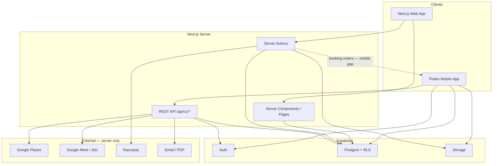

### 18.2 Mobile app launch and navigation

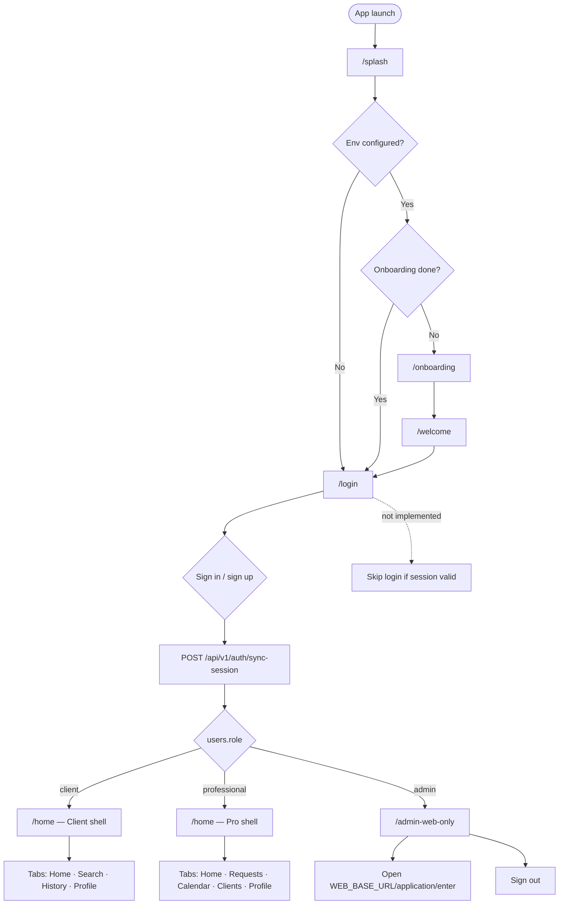

### 18.3 go_router auth guard (redirect logic)

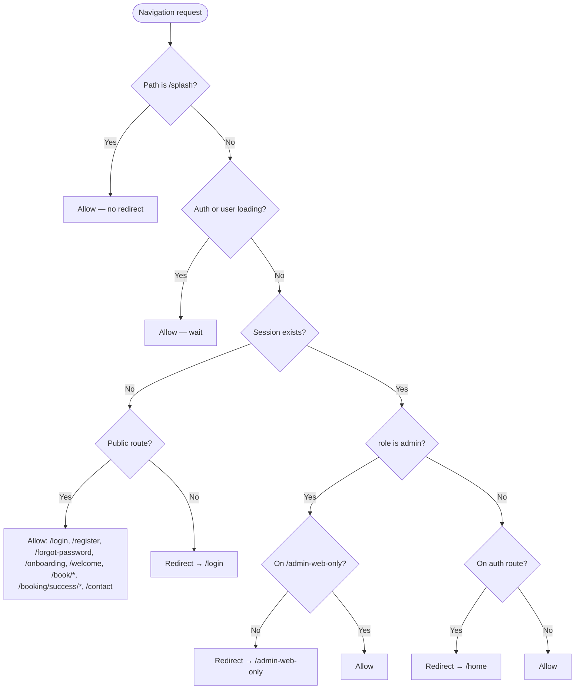

### 18.4 Authentication flow

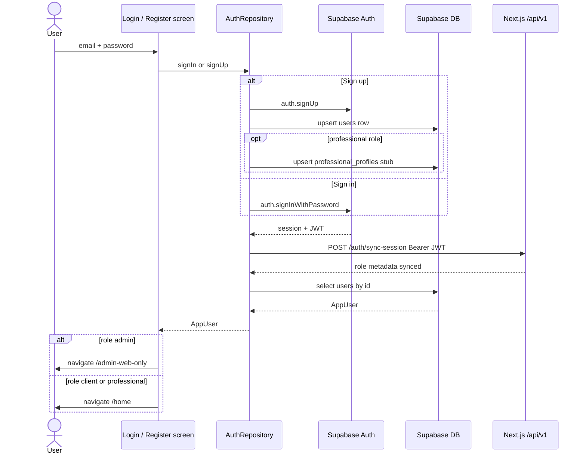

### 18.5 Data layer — when SDK vs REST

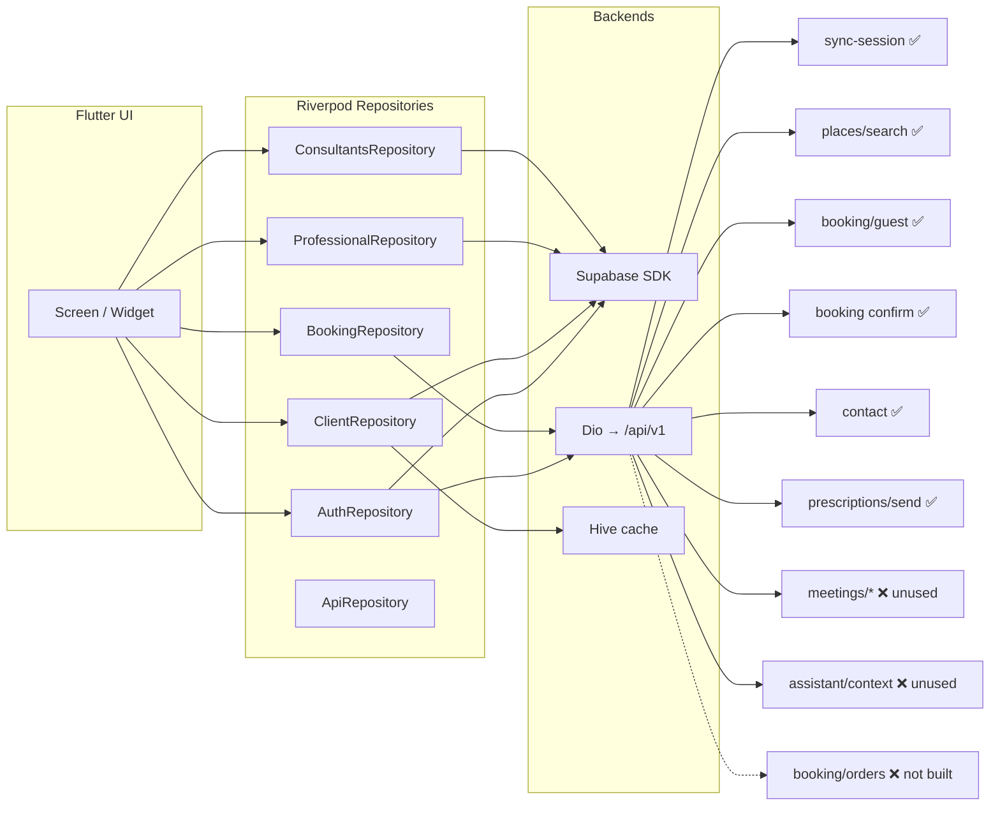

### 18.6 Client user journey (implemented)

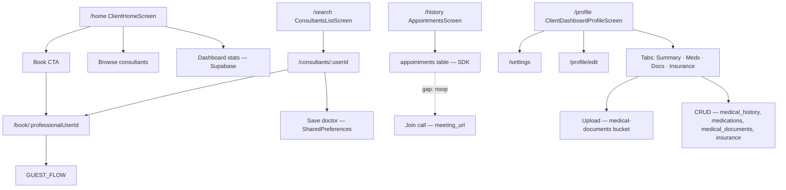

### 18.7 Professional user journey (implemented)

```mermaid
flowchart TD
  PHOME["/home ProfessionalHomeScreen"] --> PSTATS["Stats + guest bookings — SDK"]
  PHOME --> UPCOMING["Upcoming appointments"]

  REQUESTS["/requests ProfessionalConsultationsScreen"] --> GUEST["guest_appointments list"]
  REQUESTS --> UPCOMING2["appointments list"]
  GUEST --> RX["/prescription/:guestAppointmentId"]
  RX --> SEND["POST /api/v1/prescriptions/send"]

  CALENDAR["/calendar Availability CRUD"] --> AVAIL["professional_availability — SDK insert/update/delete"]

  CLIENTS["/clients Read-only list"] --> FROM_APT["Distinct clients from appointments join"]

  PPROFILE["/profile ProfessionalDashboardProfileScreen"] --> CRED["Credentials panel"]
  CRED --> QUAL["professional_qualifications + qualifications bucket"]

  PPROFILE -.->|"gap: not routed"| PAY["ProfessionalPaymentsScreen placeholder"]
```

### 18.8 Guest booking flow (mobile — legacy path)

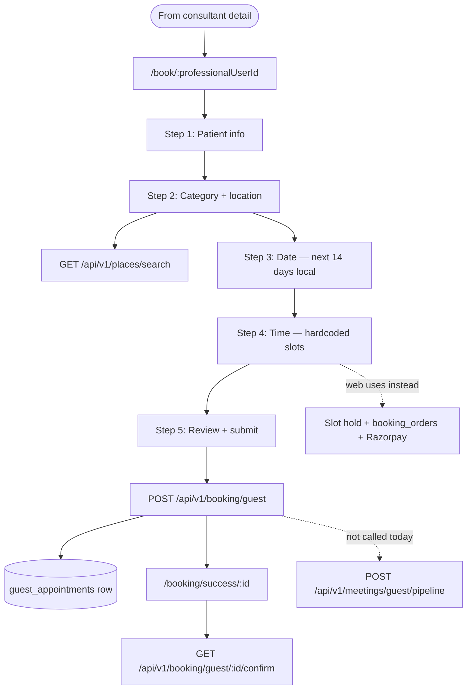

### 18.9 Guest booking flow (web — target parity)

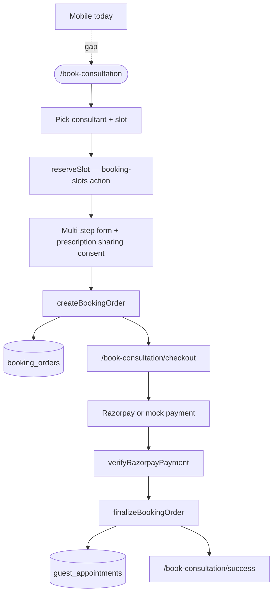

### 18.10 Web dashboard vs mobile shell

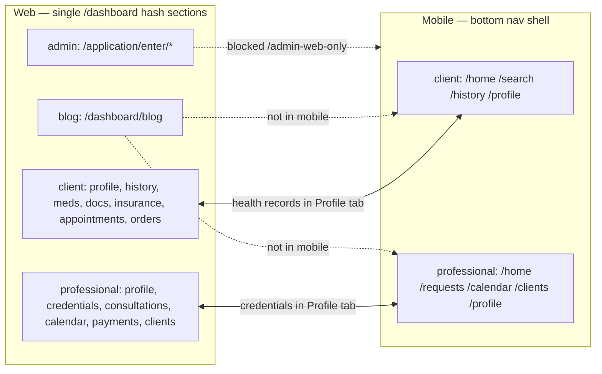

### 18.11 End-to-end request lifecycle (authenticated read)

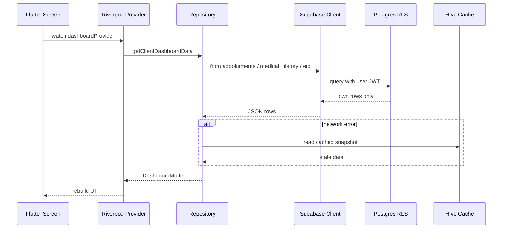

---

## 19. Complete Screen Navigation Reference

> **Copy-friendly reference** — every routed screen, entry conditions, and where each action goes.  
> Source: `mobile/lib/core/router/app_router.dart` + screen `context.go` / `context.push` calls.

### 19.1 Global router rules (go_router redirect)

These run **before** any screen loads (except `/splash`, which is always allowed):

| # | Condition | Result |
|---|-----------|--------|
| R1 | Path is `/splash` | Stay on splash (no redirect) |
| R2 | Auth or user profile still loading | Stay on requested path (wait) |
| R3 | **No session** + path is public | Allow — see [public routes](#192-public-routes-no-login-required) |
| R4 | **No session** + path is NOT public | **Redirect → `/login`** |
| R5 | **Session exists** + `role = admin` + path ≠ `/admin-web-only` | **Redirect → `/admin-web-only`** |
| R6 | **Session exists** + `role = admin` + on `/admin-web-only` | Allow |
| R7 | **Session exists** + `role = client` or `professional` + on auth path (`/login`, `/register`, `/forgot-password`, `/onboarding`, `/welcome`) | **Redirect → `/home`** |
| R8 | **Session exists** + `role = client` or `professional` + on `/admin-web-only` | **Redirect → `/home`** |
| R9 | All other authenticated client/pro paths | Allow |

**Public routes (no login required):** `/login`, `/register`, `/forgot-password`, `/onboarding`, `/welcome`, `/book/*`, `/booking/success/*`, `/contact`

**Auth required (examples):** `/home`, `/search`, `/history`, `/profile`, `/requests`, `/calendar`, `/clients`, `/settings`, `/consultants/:userId`, `/prescription/:id`, `/profile/edit`

---

### 19.2 App cold start

| Step | Screen | Route | Condition | Next screen |
|------|--------|-------|-----------|-------------|
| 1 | Splash | `/splash` | App opens | Wait 1.8s, then check below |
| 2a | — | — | `Env` not configured (missing `.env.mobile`) | → `/login` |
| 2b | Onboarding | `/onboarding` | Env OK + `onboarding_complete` = false | User chooses below |
| 2c | Login | `/login` | Env OK + onboarding already done | User signs in |
| 3 | Register | `/register` | Onboarding → tap **Create an account** (sets onboarding done) | After signup → `/home` |
| 4 | Login | `/login` | Onboarding → tap **Login** (sets onboarding done) | After signin → see [auth outcomes](#194-after-login--register) |

> **Note:** `/welcome` is registered but **not used** by splash/onboarding today. It only loads if navigated manually.

---

### 19.3 After login / register

| Condition | Next route | Screen shown |
|-----------|------------|--------------|
| Sign-in success + `role = client` | `/home` | `ClientHomeScreen` (client shell) |
| Sign-in success + `role = professional` | `/home` | `ProfessionalHomeScreen` (pro shell) |
| Sign-in success + `role = admin` | `/admin-web-only` | `AdminWebOnlyScreen` |
| Register success (client or pro only; admin blocked at signup) | `/home` | Role-appropriate home |
| Router intercepts admin on any other path | `/admin-web-only` | Admin blocker |

**Side effect on every sign-in/sign-up:** `POST /api/v1/auth/sync-session` (sync JWT role metadata).

---

### 19.4 Auth screens

| Screen | Route | How you get here | User action | Goes to |
|--------|-------|------------------|-------------|---------|
| Login | `/login` | Splash, redirect R4, sign-out, onboarding | Tap **Go to Home** (submit) | `/home` or `/admin-web-only` by role |
| Login | `/login` | | Tap **Forgot password?** | `push` → `/forgot-password` |
| Login | `/login` | | Tap **Register** | `push` → `/register` |
| Register | `/register` | Login link, onboarding CTA, welcome CTA | Submit valid form (client or pro) | `/home` |
| Register | `/register` | | Select admin role | **Error** — not allowed on mobile |
| Forgot password | `/forgot-password` | Login, Settings | Submit email | Stay — show “Check your email” |
| Forgot password | `/forgot-password` | | Tap **Back to sign in** | `/login` |
| Admin web only | `/admin-web-only` | Admin login or redirect R5 | **Open web admin** | External browser → `WEB_BASE_URL/application/enter` |
| Admin web only | `/admin-web-only` | | **Sign out** | `/login` |

---

### 19.5 Client shell (role = client, session required)

Bottom nav switches route; `DashboardShell` renders the matching screen.

| Tab | Route | Screen | Main navigations out |
|-----|-------|--------|----------------------|
| Home | `/home` | `ClientHomeScreen` | Search tile → `/search` · History tile → `/history` · Doctor card → `push` `/consultants/:id` · Book CTA → `/search` |
| Search | `/search` | `ConsultantsListScreen` | Consultant row → `push` `/consultants/:id` |
| History | `/history` | `AppointmentsScreen` | Empty state → `/search` · Message → `push` `/contact` · Rebook → `/search` |
| Profile | `/profile` | `ClientDashboardProfileScreen` | Edit → `push` `/profile/edit` · Settings icon → `push` `/settings` · In-tab: meds/docs/insurance CRUD (no route change) |

---

### 19.6 Professional shell (role = professional, session required)

| Tab | Route | Screen | Main navigations out |
|-----|-------|--------|----------------------|
| Home | `/home` | `ProfessionalHomeScreen` | Guest booking card → `push` `/prescription/:guestAppointmentId` |
| Requests | `/requests` | `ProfessionalConsultationsScreen` | Guest item → `push` `/prescription/:guestAppointmentId` |
| Calendar | `/calendar` | `ProfessionalSectionScreen` (calendar) | Add/delete availability slots (modal, no route) |
| Clients | `/clients` | `ProfessionalSectionScreen` (clients) | Read-only list |
| Profile | `/profile` | `ProfessionalDashboardProfileScreen` | Settings → `push` `/settings` · Credentials panel inline |

---

### 19.7 Consultant → booking flow

| Step | Route | Auth required? | Condition / trigger | Next |
|------|-------|----------------|---------------------|------|
| 1 | `/search` or `/home` | Yes | User browses consultants | Tap consultant |
| 2 | `/consultants/:userId` | Yes | Consultant detail loaded | Tap **Book appointment** |
| 3 | `/book/:professionalUserId` | **No** (public) | Multi-step form (5 steps) | Submit success |
| 4 | `/booking/success/:id` | **No** (public) | `POST /api/v1/booking/guest` returns id | Tap **Back to home** |
| 5 | `/home` | Yes | Success button | **If not logged in → redirect R4 → `/login`** |

**Booking form steps (same route, internal `PageView`):**  
(1) Patient info → (2) Category + city (`GET /places/search`) → (3) Date (next 14 days) → (4) Time (hardcoded slots) → (5) Review → submit.

---

### 19.8 Prescription flow (professional only)

| Step | Route | Condition | Next |
|------|-------|-----------|------|
| 1 | `/home` or `/requests` | Pro sees guest appointment | Tap item |
| 2 | `/prescription/:guestAppointmentId` | Session + pro role | Compose text → **Send** |
| 3 | Previous screen | `POST /api/v1/prescriptions/send` success | `context.pop()` back |

---

### 19.9 Settings & profile

| Screen | Route | How you get here | Action | Goes to |
|--------|-------|------------------|--------|---------|
| Settings | `/settings` | Profile → Settings | Notifications row | `push` → `/settings/notifications` |
| Settings | `/settings` | | Change password row | `push` → `/forgot-password` |
| Settings | `/settings` | | Log out | `/login` |
| Notifications | `/settings/notifications` | Settings | Toggle switches | Stay (local only, no backend) |
| Profile edit | `/profile/edit` | Client profile → Edit | Save | `pop` back |
| Contact | `/contact` | Appointments message, or direct | Submit form | Stay (success message) |

---

### 19.10 Master navigation diagram (copy)

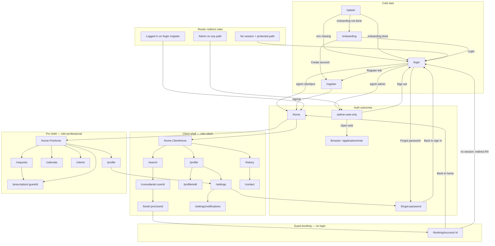

---

### 19.11 Screen inventory (all routes)

| Route | Screen widget | Login? | Role | In bottom nav? |
|-------|---------------|--------|------|----------------|
| `/splash` | SplashScreen | — | — | — |
| `/onboarding` | OnboardingScreen | No | — | — |
| `/welcome` | WelcomeScreen | No | — | — *(unused in bootstrap)* |
| `/login` | LoginScreen | No | — | — |
| `/register` | RegisterScreen | No | — | — |
| `/forgot-password` | ForgotPasswordScreen | No | — | — |
| `/admin-web-only` | AdminWebOnlyScreen | Yes | admin only | — |
| `/home` | ClientHome **or** ProHome | Yes | client / pro | Yes |
| `/search` | ConsultantsListScreen | Yes | client | Yes |
| `/history` | AppointmentsScreen | Yes | client | Yes |
| `/profile` | ClientDashboardProfile **or** ProDashboardProfile | Yes | both | Yes |
| `/requests` | ProfessionalConsultationsScreen | Yes | pro | Yes |
| `/calendar` | ProfessionalSection (calendar) | Yes | pro | Yes |
| `/clients` | ProfessionalSection (clients) | Yes | pro | Yes |
| `/consultants/:userId` | ConsultantDetailScreen | Yes | both | No (push) |
| `/book/:professionalUserId` | BookConsultationScreen | **No** | — | No |
| `/booking/success/:id` | BookingSuccessScreen | **No** | — | No |
| `/prescription/:guestAppointmentId` | PrescriptionScreen | Yes | pro | No (push) |
| `/profile/edit` | ClientProfileEditScreen | Yes | client | No (push) |
| `/settings` | SettingsScreen | Yes | both | No (push) |
| `/settings/notifications` | NotificationsScreen | Yes | both | No (push) |
| `/contact` | ContactScreen | **No** | — | No |

---

### 19.12 Orphan screens (NOT in router — unreachable via normal nav)

These files exist but have **no route** in `app_router.dart`:

| Screen file | Intended purpose |
|-------------|------------------|
| `ChatScreen` | Messages placeholder |
| `BookScreen` | Alternate browse/book UI |
| `MyDoctorScreen` | Saved + booked doctors |
| `ClientAccountScreen` | Old profile hub |
| `ClientProfileScreen` | Full health tabs (only via AccountScreen `MaterialPageRoute`) |
| `ProfessionalAccountScreen` | Old pro profile hub |
| `ProfessionalProfileScreen` | Full pro tabs (only via AccountScreen) |
| `ProfessionalBookScreen` | Pro booking UI |
| `ProfessionalMyDoctorScreen` | Pro saved doctors |
| `ProfessionalPaymentsScreen` | Payments placeholder |

---

## Quick Reference

### Web team — next API work for mobile

1. Implement Section 8.2 booking/order routes (highest impact).
2. Optionally expose OTP registration as `/api/v1/auth/register-otp`.
3. Keep [docs/API.md](./API.md) updated as routes are added.

### Mobile team — next sprint

1. Wire meeting URL + `url_launcher` on appointment cards.
2. Session restore on splash.
3. Start booking parity: slot API integration once web team ships routes.
4. Add blog feature module OR explicitly defer and update README.
5. Build AI assistant screen (API already exists).
6. Clean up orphaned screens in `mobile/lib/features/`.

### Key references

- REST API: [docs/API.md](./API.md)
- Web theme: `src/app/globals.css`, `dashboard-theme.ts`
- Database: `SUPABASE_SETUP.sql`
- Development rules: `src/DEVELOPMENT_RULES.md`
- Mobile entry: `mobile/README.md`, `mobile/lib/core/router/app_router.dart`
- **Flow diagrams:** [§18 App Flow Diagrams](#18-app-flow-diagrams-mermaid)
- Rate limits: [docs/RATE_LIMITS.md](./RATE_LIMITS.md)

---

*Last updated: June 2026 — audited against HealthHere web + `mobile/` codebase.*
